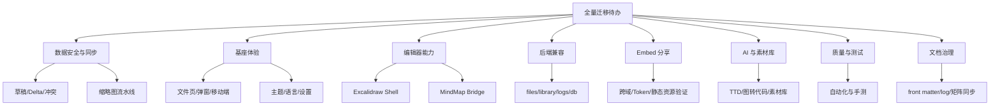

# 新架构全量迁移待办总览

> 本文是后续开发的总入口：把已有迁移矩阵、剩余遗漏、本轮 UI 修复反馈和 React 规范检查结果合并成一份可执行待办清单。

## 全景总览

> 全量迁移的核心路径是先保证数据安全，再补用户可见能力，最后用自动化与手测矩阵收口。

图解说明：根节点表示当前项目达到旧版全量功能 parity 所需的总工作。左侧 `数据安全与同步` 是最高优先级，因为它决定编辑数据是否会丢失；中间 `基座体验` 与 `编辑器能力` 是用户直接感知的功能层；右侧 `后端兼容`、`Embed 分享`、`AI 与素材库` 是跨前后端的集成层；底部 `质量与测试`、`文档治理` 是每轮开发完成前必须收口的保障项。箭头表示依赖展开关系，不表示严格串行，但 P0 数据安全类任务应先于大规模编辑器功能补齐。

## 一、当前状态口径

### 1.1 已经不再作为“完全遗漏”的能力

- 文件管理基础能力：文件/文件夹 CRUD、排序、下载、拖放导入、移动文件弹窗、卡片嵌入入口已具备基础能力。
- Embed 基础链路：token 管理、只读页、Excalidraw/MindMap viewer、受保护静态资源、CSP、cookie、前端预览入口已接入。
- 设置页基础能力：AI 配置表单、嵌入管理、外观与语言的基座级切换已接入。
- 历史版本基础能力：列表、恢复、删除、标签修改已接入。
- Text 文档：`.txt/.md` 导入、新建、打开、保存、下载已有最小闭环。
- 后端基础能力：files、ai-settings、embed-tokens、library、archives、ttd-chats、logs 已有基础路由。

### 1.2 仍不能视为完成的原因

- 多处能力仍是“基础可用”，缺旧版完整策略、边界验证、冲突处理和自动化测试。
- 文档格式、缩略图和部分编辑器 shell 还没有完全统一到新架构的 adapter/registry 模式。
- React 规范检查在 `src` 范围已无 error，但仍有 warning：历史编辑器 raw hex、inline style、`index.css` 职责过载等需要后续治理。
- `_docs/旧版功能全量迁移矩阵.md`、`_docs/旧版功能全量迁移剩余遗漏.md` 和 `新架构旧版能力填充映射.md` 已同步到 v0.2.4；后续只保留真实未闭环项。

## 二、P0：优先保证数据安全和核心闭环

### 2.1 本地草稿、Delta 与同步冲突

- 进展（v0.2.3）：已新增 `openFileSync` 决策层和单元测试，打开文件的草稿/服务端版本选择不再散落在 `FilesPage`；已补 Ctrl/⌘+S 快捷保存和编辑器同步状态提示。
- 进展（v0.2.4）：MindMap native `hostRequestSave` 已转为宿主 `saveActiveFile()` 落盘，保存状态会通过 `mindMapHostSaveStatus` 回传 iframe；前端日志会将 window error / unhandled rejection 上报 `/api/logs`。
- 进展（v0.2.2）：已新增 `FileSyncState` 单元测试并对齐旧版 baseline/draft/serverHash 语义；已迁入原生 IndexedDB 版 `DeltaStorage` 和 `LocalData`，并新增 per-file browser scene 镜像；Excalidraw 编辑变更会写入本地草稿、delta、二进制文件镜像和 browser scene；侧边栏离开编辑器时会提示保存或放弃本地草稿。
- 迁移 `DeltaStorage`、`LocalData`、`forkBrowserSceneStorage`，恢复旧版 IndexedDB delta、本地缓存和二进制文件镜像能力。
- 接线 `ServerSync.listFileHashes()`，打开文件前做 server newer 检测。
- 补保存队列、保存失败恢复、冲突提示和本地缓存过期策略。
- 将 `beforeunload`、visibility save、快捷键保存和编辑会话状态统一为同一套脏标记协议。
- 让历史恢复、保存成功、打开草稿恢复都能正确更新 baseline/server/draft hash。

### 2.2 缩略图流水线

- 进展（v0.2.1）：已新增列表级 `useThumbnailPipeline()`，对前 16 个有缩略图文件做并发预取；新增服务端 SVG 内存缓存，`FileCard` 会优先复用缓存再懒加载；编辑器草稿变更会防抖生成本地草稿缩略图并触发卡片刷新。
- 迁移 `ThumbnailPipeline` / `useThumbnailPipeline`，恢复列表级并发编排。
- 迁移 `thumbCoverage`，恢复前 16 项预取和覆盖率判断。
- 迁移 `thumbnailExport.ts`，在新建、导入、编辑保存时生成真实缩略图。
- 接通 draft 缩略图：本地草稿更新时生成本地缩略图，保存成功后清理 draft cache。
- 补 MindMap SVG 规范化、空 SVG 重试、hash immutable URL 和懒加载/预取协同。

### 2.3 文档格式统一

- 进展（v0.2.1）：保存与导入写入服务器前已统一经过 `DocumentFormatAdapter.toDocument()` 包装；`TextDocumentAdapter` 已能迁移 managed text 文档，下载再导入路径不再依赖裸字符串。
- 统一 Excalidraw/MindMap/Text 的保存与打开格式，避免 Excalidraw 继续多处保存裸 scene。
- 让 `editorStore`、导入、下载、缩略图、历史恢复都通过 `ManagedDocument` / `DocumentFormatAdapter`。
- 补 Excalidraw ManagedDocument wrapper、迁移器和旧数据兼容测试。
- 手测普通图片导入为 Excalidraw image element 后能显示、保存、下载再导入。

### 2.4 后端核心兼容

- 进展（v0.2.1）：`POST /api/files/move` 已补空 `file_ids` 校验、重复 id 去重、不存在文件 404、移动后返回 `updated_at`/`moved`；archives 列表已补文件存在校验和 `limit` 上限；服务端已增加 HTTP trace 结构化日志，4xx/5xx 走 warn/error，普通请求可通过 debug 日志排查。
- 对 `server/db.js` 做空库、旧库、缺列、损坏数据 smoke。
- 补 `POST /api/files/move` 旧版行为兼容：空 `file_ids` 校验、是否 bump `updated_at`、移动后树刷新。
- 补 archives 列表上限、保存前 archive 腾位和保存事件派发。
- 补 server logger 的 HTTP trace、结构化字段、错误诊断信息。

## 三、P1：补齐用户可见能力

### 3.1 文件管理页面

- 进展（v0.2.1）：已补窄屏文件夹抽屉入口，移动端可打开文件夹树；搜索结果已在文件卡片名称中高亮首个匹配片段；多文件导入时会显示当前进度和文件名，失败仍汇总提示。
- 补移动端文件夹树/抽屉，保证窄屏下文件夹导航可用。
- 搜索结果增加匹配高亮，而不是只过滤。
- 多文件导入补进度 UI、失败汇总和更接近事务语义的回滚策略。
- `.excalidrawlib` 应明确引导到素材库导入，不进入文件列表文档导入。
- 文件卡片 sync/draft 徽章要与真实 FileSyncState、LocalDraftStorage、缩略图状态闭环。

### 3.2 设置、外观和语言

- 当前基座文案已支持轻量中英文切换；后续需扩展到更多基座页面和所有新增面板。
- 将编辑器主题和语言彻底下发到 Excalidraw、MindMap iframe 和 Text editor。
- MindMap 语言保存、宿主设置页语言、native local config 需要双向同步。
- 继续治理 `index.css`：按 `react-stack` 建议拆分为 tokens/base/layout/components/utilities。

### 3.3 历史版本

- 进展（v0.2.1）：保存成功后会派发历史列表失效事件，打开的历史面板可静默刷新；恢复历史前会检测本地未保存草稿并二次确认；恢复后会清理本地草稿缩略图、重置 hash 并重新打开恢复后的数据。
- 保存成功后静默刷新历史列表或标记历史列表过期。
- 恢复前检测未保存内容，并给出明确确认。
- 恢复后清理本地草稿、重置 hash、刷新缩略图和文件卡片状态。
- 补 archives API 的边界测试：不存在文件、损坏归档、标签为空、列表上限。

### 3.4 Embed 分享

- 补无 token、错 token、域名不匹配、合法 token 的自动化测试。
- 进展（v0.2.4）：`GET /api/embed-tokens` 已纳入同源校验，新增服务端同源判断测试。
- 验证 `/embed/assets/*`、`/embed/fonts/*`、`/embed/mind-map/*` 的 token gate。
- 验证跨域 iframe、HTTPS、反向代理、SameSite/CSP `frame-ancestors`。
- 验证 token 修改/删除后的 cache 失效、usage count、并发和多进程部署风险。
- 补旧版 FocusGate、viewport pin、加载失败诊断等 viewer 体验。

## 四、P1：编辑器专项迁移

### 4.1 Excalidraw Shell

- 进展（v0.2.3）：Excalidraw 已通过 `CombinedLibraryAdapter` 读取 public/personal/canvas 三层素材，并通过 `onLibraryChange` 写入素材库同步队列；已接入 MainMenu、WelcomeScreen、Footer、TTDDialogTrigger，并将 TTD 文本生成接到 OpenAI-compatible runtime。
- 进展（v0.2.2）：编辑器浮动工具栏已补“文件 / 历史 / 嵌入 / AI / 保存”入口，其中历史和嵌入直接打开当前文件上下文，AI 入口先回到设置页配置。
- 补完整旧版工具栏：保存、历史、Embed、AI、素材库、返回文件、状态提示。
- 恢复 main menu、welcome screen、footer、命令面板入口和旧版快捷动作。（v0.2.3 已恢复 main menu / welcome / footer / TTD 入口；命令面板扩展项仍待按上游包 API 继续评估。）
- 接 `onLibraryChange`、`useHandleLibrary`、CombinedLibraryAdapter。（v0.2.3 已接数据适配器和 `onLibraryChange`；`useHandleLibrary` / 旧版分组增强仍需评估包策略。）
- 接 `onAIGenerate()`、TTD、Diagram-to-Code、AI 未配置提示。
- 完整接入 editor theme/lang props，并验证与基座设置同步。

### 4.2 MindMap Host Bridge

- 进展（v0.2.3）：已迁入 `mindMapBrowserViewStorage`，按文件保存/恢复 view 和 scale；AI 配置会在应用启动加载并以旧版兼容 payload 下发给 MindMap native；`CLIPBOARD_READ` 已从只回传 MIME types 改为回传文本和图片 dataUrl 内容。
- 进展（v0.2.4）：MindMap 原生保存请求会进入宿主保存队列，保存中/已同步/未保存/失败状态会回传 native。
- 进展（v0.2.2）：已接入 `hostOpenHistory`、`hostOpenEmbedManager`、`hostOpenAISettings`、`hostBackToFiles` 到 React 宿主事件，MindMap native 工具栏可请求打开宿主历史、嵌入、AI 设置和文件页。
- 稳定 `hostOpenHistory`、`hostOpenEmbedManager`、`hostOpenAISettings`、`hostBackToFiles` 协议。
- 让 MindMap 工具栏能直接打开当前 React 历史、Embed、AI 设置面板。
- 迁移 `mindMapBrowserViewStorage`、`mindMapOpenState`、`mindMapPrefetch`。（v0.2.3 已完成 browser view/scale storage。）
- 补后台服务端刷新、view/scale/open-state 持久化和刷新恢复。
- 覆盖剪贴板读写、图片写入、AI 配置下发、dirty 状态上报的手测矩阵。

### 4.3 Text Editor

- 保持最小编辑器闭环，同时补 autosave 状态、下载再导入和缩略图预览测试。
- 如后续要支持 Markdown preview，应单独设计，不与当前 parity 任务混在一起。

## 五、P1：AI 与素材库

### 5.1 AI 运行时

- 进展（v0.2.3）：已新增 `src/features/ai/*`，迁入 OpenAI-compatible streaming、Vision HTML、Icon Tag 基础客户端；应用启动会加载服务端 AI 配置；已新增 TTD 持久化 adapter，支持 `/api/ttd-chats` 与本地回退。
- 新建或迁移 `src/features/ai/*`。
- 迁移 OpenAI-compatible streaming。
- 恢复 Excalidraw TTD 对话框、Diagram-to-Code、图标标签模型调用。
- 接 `ServerSync.getTTDChats/saveTTDChats` 的前端消费。
- 补 AI 未配置、请求失败、流式中断、超大 payload 的用户提示。

### 5.2 素材库

- 进展（v0.2.3）：已新增 `src/features/library/*`，完成 CombinedLibraryAdapter MVP、library sync queue、current fileId 接线，并接入 Excalidraw `initialData.libraryItems` / `onLibraryChange`。
- 进展（v0.2.4）：素材库同步 payload 已带 `groups`，本地 mirror 支持读写；服务端读取失败时会回退到本地素材库镜像。
- 进展（v0.2.2）：设置页已新增“素材库”入口，可读取并展示服务端 public / personal / groups 素材数据，为后续 Excalidraw 素材面板接入 `CombinedLibraryAdapter` 提供可见管理入口。
- 迁移 `CombinedLibraryAdapter`。
- 恢复 public / personal / canvas 三层素材库合并与同步。
- 恢复素材分组、折叠、排序、URL 导入自动建组。
- 接 library sync queue 和素材库 AI 打标。
- 对后端 `library_groups`、public/personal/canvas API 做旧库兼容 smoke。

## 六、P2：质量、规范与测试

### 6.1 自动化测试

- 后端 smoke：health、files tree、files move、archives restore、library sync、embed token、TTD 413、logs ingest、embed 资源策略。
- 前端单元/组件测试：格式识别、导入回滚、下载再导入、缩略图选择、FileSyncState、LocalDraftStorage、settings API。
- E2E 或手测固化：新建/打开/编辑/保存/刷新恢复/历史恢复/Embed 打开/AI 未配置/MindMap clipboard。
- 原生依赖 smoke：`better-sqlite3` ABI 与当前 Node 版本匹配。

### 6.2 React Stack 规范治理

- 完成前必须运行：
  - `node /root/shared/skills/react-stack/check-react-quality.mjs /root/projects/archive/excalidraw-web/src --strict-ui`
  - `yarn test:typecheck`
  - `yarn build`
- 逐步消除当前 warning：
  - 编辑器和缩略图中的 raw hex。
  - Embed viewer 中未说明的 inline style。
  - `FolderTree` / `MoveFileDialog` 中动态缩进 style 需保留说明或迁移为 CSS 变量策略。
  - `index.css` 职责过载，需拆分样式文件。
- 对 `_old/` 不做规范修复，除非明确需要修改归档源码。

### 6.3 文档治理

- `_docs/旧版功能全量迁移矩阵.md`、`_docs/旧版功能全量迁移剩余遗漏.md` 已有 `llm-wiki` front matter。
- 每完成一个迁移阶段，同步更新：
  - `[[旧版功能全量迁移矩阵]]`
  - `[[旧版功能全量迁移剩余遗漏]]`
  - 本文档对应待办状态
  - `_docs/log.md`
- 保持 `_docs/structure.md` 的 version 规则：产品设计、架构方案和迁移计划类文档需要维护 `version` 与版本记录。

## 七、建议实施顺序

1. 数据安全优先：DeltaStorage、LocalData、server newer 检测、冲突提示、保存队列。
2. 缩略图与文档格式：完整 thumbnail pipeline、ManagedDocument 统一保存/打开/导入/下载。
3. 文件管理收口：移动端树、搜索高亮、批量导入事务、draft/sync 徽章闭环。
4. Embed 验证收口：token、域名、静态资源、跨域 iframe、MindMap viewer 体验。
5. Excalidraw Shell：素材库、AI/TTD、工具栏、菜单、命令入口。
6. MindMap Shell：hostOpen*、历史/Embed/AI 面板、浏览器视图缓存、后台刷新。
7. 后端兼容与运维：旧库迁移 smoke、logger、HTTP trace、payload 边界。
8. 测试与文档：自动化测试、手测矩阵、front matter、日志和迁移矩阵同步。

## 八、每阶段完成定义

- 功能可用：真实 UI 可操作，不只是源码存在。
- 数据安全：刷新、关闭、离开、保存失败、恢复历史都不丢数据。
- 后端持久化：重启服务后数据仍存在，旧库/空库路径可用。
- 文档同步：矩阵、遗漏清单、本文档、log 均更新。
- 规范验证：React quality check 当前修改范围无 error。
- 构建验证：`yarn test:typecheck` 和 `yarn build` 通过。
- 手测记录：对应用户流有明确手测结果或未验证说明。

## 版本记录

| 版本 | 日期 | 说明 |
|------|------|------|
| v0.2.4 | 2026-05-20 | 补 P0 遗漏：MindMap native 保存落盘和保存状态回传、Embed token GET 同源校验、前端日志上报、素材库 groups payload 与本地 mirror 回退，并同步过期迁移文档 |
| v0.2.3 | 2026-05-20 | 继续完整迁移：新增架构填充映射文档、抽出打开文件同步决策层、补 Ctrl/⌘+S 与同步状态、MindMap view storage、AI 配置运行时、OpenAI-compatible 客户端、TTD 持久化、CombinedLibraryAdapter MVP 与 Excalidraw 素材库数据接线 |
| v0.2.2 | 2026-05-20 | 继续推进未完成项：补 FileSyncState 测试、DeltaStorage/LocalData/browser scene 本地持久层、离开编辑器草稿保护、编辑器工具栏入口、MindMap hostOpen 事件和素材库设置入口 |
| v0.2.1 | 2026-05-20 | 推进 P0 同步/草稿闭环：server hash 接线、草稿冲突提示、保存队列、pending draft flush 和服务端保存乐观锁 |
| v0.2.0 | 2026-05-20 | 创建全量迁移待办总览，归并迁移矩阵、剩余遗漏、本轮 UI/Embed/React 规范检查结论 |
