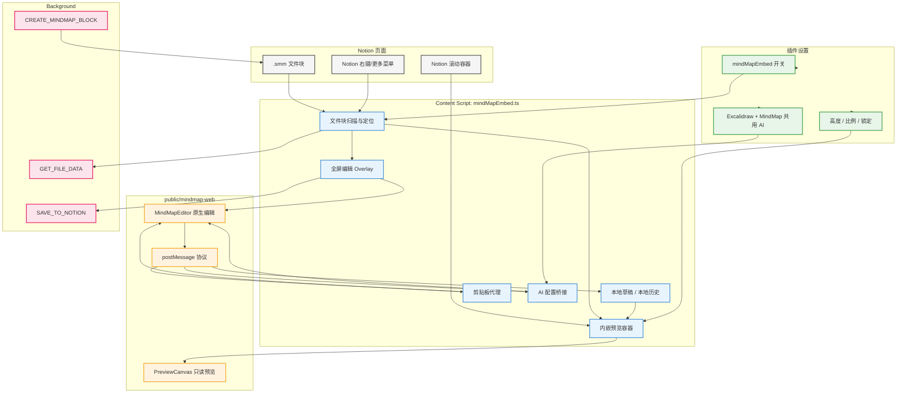

# Notion 插件 MindMap 有价值改动清单

> 这份清单用于沉淀 Notion 插件版 MindMap 的可迁移设计。插件已经实现了从 Notion `.smm` 文件块识别、预览、编辑、保存、草稿、历史、剪贴板、AI 到构建打包的一整套宿主适配能力。

## 全景总览

> Notion 插件的 MindMap 能力分为内容脚本、后台 Notion API、MindMap Web iframe、插件设置和本地缓存五层。



图解说明：Notion 页面只提供 `.smm` 文件块和 DOM 容器；`mindMapEmbed.ts` 是核心宿主层，负责扫描、渲染预览、打开编辑器、接收 iframe 消息、维护草稿历史和转发剪贴板/AI；`public/mindmap-web` 是真正的 MindMap UI 与画布；后台脚本负责访问 Notion 内部 API 完成文件读取、创建和上传；插件设置统一控制是否启用、预览尺寸和 AI 配置。

## 一、插件入口与功能注册

MindMap 已经作为独立功能接入插件的 feature system。`entrypoints/content.ts` 注册了以下入口：

- `mindMapEmbed`：启用或关闭 MindMap 预览与编辑。
- `mindMapEmbedHeight`：设置预览高度。
- `mindMapEmbedKeepAspectRatio`：是否按比例计算预览高度。
- `mindMapEmbedAspectRatio`：设置预览比例。

`components/settings.ts` 也新增了对应默认值和设置项：

- `mindMapEmbed: true`
- `mindMapEmbedHeight: "360"`
- `mindMapEmbedKeepAspectRatio: false`
- `mindMapEmbedAspectRatio: "16:9"`
- `embedLockByDefault: false`

有价值点：MindMap 不再是临时代码，而是像 Excalidraw 一样进入插件功能注册、设置面板和运行时开关体系。

## 二、构建与 Manifest 适配

`wxt.config.ts` 把 `mindmap-web/index.html` 注册为 sandbox page，并把 `mindmap-web/*` 暴露为 web accessible resource。

`scripts/bundle-mindmap.mjs` 负责把外部 MindMap Web 构建结果复制到 `public/mindmap-web/`，让 WXT 打包进扩展。

有价值点：

- MindMap 页面以 iframe/sandbox 形式运行，隔离主页面和编辑器运行环境。
- 插件源码和 MindMap Web 构建产物分离，便于替换上游 MindMap Web。
- 打包脚本明确了构建产物同步路径。

需要注意：`public/mindmap-web` 是构建产物，不是主要维护源码。后续追踪原始实现时要找到对应的 `stable/mindmap-web` 或源项目。

## 三、`.smm` 文件块识别

`components/features/mindMapEmbed.ts` 会扫描 Notion 文件块，识别包含 `.smm` 且不包含 `.excalidraw` 的 block。

主要处理包括：

- 从 `.notion-file-block` 和 `[data-notion-file]` 查找候选节点。
- 通过 `data-block-id` 或 `data-id` 向上追溯真正的 Notion block。
- 在 peek page 场景下优先处理 `.notion-overlay-container` 内的 block。
- 用可见面积给候选 block 打分，避免同一文件块被重复识别到多个 DOM 节点。

有价值点：这套逻辑解决了 Notion DOM 结构复杂、同一 block 多层嵌套、peek 页面与普通页面并存的问题。

## 四、内嵌预览能力

插件会为 `.smm` 文件块创建 `mindmap-embed-wrapper`，并加载：

```text
mindmap-web/index.html?mode=preview&lang=<locale>
```

预览能力包括：

- 加载中状态和空内容状态。
- 显示文件名。
- 定位按钮：向 iframe 发送 `MINDMAP_PREVIEW_LOCATE`。
- 全屏编辑按钮：调用 `openEditor(block)`。
- 预览锁定：单击定位，双击切换锁定；锁定时 iframe `pointerEvents = none`，避免误拖拽 MindMap。
- 滚轮转发：锁定状态下将滚轮事件转发给 Notion scroller。
- 高度和比例：支持固定高度，也支持按 block 宽度和比例计算高度。
- 懒加载/挂起：离屏 10 秒后移除 iframe `src`，回到视口再恢复。

有价值点：插件没有只做一个静态 iframe，而是把预览当作 Notion 页面布局的一部分处理，包含滚动、定位、锁定、性能和尺寸配置。

## 五、布局与 Notion 滚动容器适配

MindMap 预览不是直接插在文件 block 内部，而是在 Notion scroller 下创建 `mindmap-embeds-root`，通过绝对定位覆盖到目标 block 位置。

相关能力包括：

- `findScrollerFor(block)`：识别普通页面和 peek 页面中的 Notion scroller。
- `updateEmbedPosition(blockId)`：根据 block 与 scroller 的 rect 计算 overlay 位置。
- `updateSpacerStyles()`：给原始文件 block 增加 `margin-bottom`，为预览留出真实空间。
- `ResizeObserver`：监听 Notion frame 和目标 block 尺寸变化。
- `IntersectionObserver`：控制离屏 iframe 挂起。
- 自定义事件 `nb-embed-layout-change`：触发布局刷新。

有价值点：这套布局适配避免 iframe 破坏 Notion 原有 DOM，同时解决预览高度覆盖后续内容的问题。

## 六、全屏编辑器

点击预览或文件块会打开 `mindmap-editor-overlay`，内部 iframe 加载同一个 `mindmap-web/index.html`，但不带 `mode=preview`，进入编辑模式。

打开编辑器时会：

- 记录当前 block 和文件 URL。
- 禁用 body 滚动。
- 注册 Escape 快捷键关闭编辑器。
- 等待 iframe 发 `MINDMAP_READY_FOR_DATA` 后发送 `MINDMAP_EDITOR_INIT`。
- 优先使用本地草稿，其次使用缓存的服务器数据。
- 后台再次请求 Notion 文件内容，作为最新服务器版本和放弃修改基线。
- 记录 `originalSnapshot`，用于区分初始数据和用户修改。

有价值点：编辑器打开时同时考虑本地草稿、服务器版本、远端延迟返回和初始化空保存噪声，避免用户已有内容被初始空数据覆盖。

## 七、保存、暂存和关闭语义

插件区分三类退出/保存动作：

- `MINDMAP_CLOSE`：关闭编辑器，清本地草稿，回到服务器版本。
- `MINDMAP_STASH`：暂存当前编辑，不上传 Notion，关闭编辑器。
- `MINDMAP_SAVE_AND_CLOSE`：保存到 Notion，成功后关闭编辑器。

编辑过程中的 `MINDMAP_SAVE` 不直接上传，只更新 `dataCache` 和本地草稿：

- 如果当前内容和服务器版本 fingerprint 一致，则清除草稿。
- 否则写入 `nb-mindmap-draft:<blockId>`。
- 打开后 2 秒内收到空数据且已有更丰富数据时，会忽略这类初始化噪声。

有价值点：这套语义很适合迁移到当前系统：编辑变更只更新草稿，明确保存或保存并返回时才写服务器。

## 八、保存回 Notion

真正保存由 `executeSave()` 触发，流程是：

1. 从 `dataCache` 取最新 MindMap 数据。
2. 序列化为 JSON。
3. 解析文件名，优先从 Notion block 或 file URL 读取。
4. 获取 blockId、spaceId、userId。
5. 调用 `SAVE_TO_NOTION` 后台消息。
6. 后台执行 Notion 上传和 block source 更新。

保存成功后：

- 显示成功 toast。
- 删除 file URL cache。
- 写入本地历史 `nb-mindmap-hist:<blockId>`。
- 清除本地草稿。
- 更新 `serverDataCache`。
- 刷新内嵌预览 iframe。
- 清除未保存 badge。
- 如果是保存并关闭，则关闭编辑器。

保存失败后：

- 显示失败 toast。
- 通知 iframe `MINDMAP_SAVE_RESULT`，让编辑器继续保留当前状态。

有价值点：保存完成后的状态同步很完整，覆盖 toast、缓存、历史、预览刷新和 UI 未保存状态。

## 九、后台 Notion API 能力

`entrypoints/background.ts` 增加了三个与 MindMap 相关的后台能力。

### 9.1 读取文件内容

`GET_FILE_DATA` 会：

- 通过 `syncRecordValues` 读取 block record。
- 从 block properties 中取 `source`。
- 如果 source 暂时没有，按 1s/2s/3s/4s 重试。
- 调 `getSignedFileUrls` 获取 signed URL。
- fetch 文件内容并 JSON parse。

### 9.2 创建 MindMap 文件块

`CREATE_MINDMAP_BLOCK` 复用 Excalidraw 创建流程，但创建的是：

- 文件名：`mindmap.smm`
- 文件内容：`createEmptyMindMapContent()`
- 结果事件：`MINDMAP_CREATE_RESULT`

空 MindMap 初始内容包含：

- `layout: "logicalStructure"`
- 根节点 `<p>根节点</p>`
- `richText: true`
- `theme.template: "classic4"`
- `view.transform` 和 `view.state`

### 9.3 上传保存

`SAVE_TO_NOTION` 会：

- 调 `getUploadFileUrl`，优先 `secure` bucket，400 时 fallback 到 `temporary`。
- 支持 S3 POST 和 PUT 两种上传方式。
- 对 temporary bucket 尝试写入 `file_ids`。
- 通过 `saveTransactions` 更新 block properties 的 `source` 和 `size`。
- 回传 `EXCAL_UPLOAD_RESULT`。

有价值点：后台实现已经覆盖 Notion 文件生命周期的读取、创建、上传和 source 更新。需要注意事件名仍叫 `EXCAL_UPLOAD_RESULT`，这是历史命名残留。

## 十、本地草稿与历史

插件的 MindMap 本地状态有两类 key：

- `nb-mindmap-draft:<blockId>`：当前未保存草稿。
- `nb-mindmap-hist:<blockId>`：本地历史快照，最多 8 条。

未保存 badge 由 `setUnsavedBadge(blockId, show)` 维护，会在预览 wrapper 上添加 `.nb-embed-unsaved`。

历史面板能力：

- 在编辑器 overlay 内显示 `.nb-history-panel`。
- 显示“线上版本（已保存）”。
- 显示本地历史快照列表。
- 点击恢复会向编辑器 iframe 发送 `MINDMAP_EDITOR_INIT`。
- 恢复线上版本会清除本地草稿。

有价值点：插件历史虽然是 localStorage 本地历史，但提供了清晰的“服务器版本 + 本地快照”交互模型。

## 十一、剪贴板代理与粘贴增强

这是插件里很有价值且容易遗漏的改动。MindMap iframe 运行在扩展 sandbox 中，直接访问系统剪贴板可能受权限、焦点或 iframe 限制。因此插件在 content script 中实现了剪贴板代理。

### 11.1 写入文本剪贴板

iframe 发：

```text
CLIPBOARD_WRITE_TEXT
```

宿主调用：

```text
navigator.clipboard.writeText(text)
```

然后回传：

```text
CLIPBOARD_RESULT
```

### 11.2 读取纯文本剪贴板

iframe 发：

```text
CLIPBOARD_READ_TEXT
```

宿主调用：

```text
navigator.clipboard.readText()
```

然后回传：

```text
CLIPBOARD_READ_RESULT
```

### 11.3 读取复杂剪贴板内容

iframe 发：

```text
CLIPBOARD_READ
```

宿主调用：

```text
navigator.clipboard.read()
```

并把剪贴板 items 转成：

```ts
{
  types: string[];
  entries: Record<string, string>;
}
```

处理规则：

- `image/*`：Blob 转 base64。
- `text/plain`：Blob 转 text。
- 单项读取失败时跳过该类型。
- 整体失败时返回 `CLIPBOARD_READ_ITEMS_RESULT` 且 `ok: false`。

有价值点：这让 MindMap 支持文本复制、文本粘贴、图片粘贴和复杂 clipboard item 粘贴。迁移到当前系统时，iframe 版 MindMap 也应该考虑复用这套宿主剪贴板桥。

## 十二、MindMap 原生粘贴逻辑保留

构建产物 `TouchEvent-CPVkx_ud.js` 中仍保留 simple-mind-map 的原生粘贴能力：

- 富文本编辑区监听 `paste`。
- 识别 SMM 格式文本。
- 多行文本可转成多个子节点。
- 图片粘贴后可通过 `SET_NODE_IMAGE` 写入选中节点。
- 普通节点数据可走 `PASTE_NODE`。

这说明插件的剪贴板设计是双层的：

- 宿主层负责真实系统剪贴板读写。
- MindMap 内核负责把文本、图片、节点数据插入图中。

## 十三、AI 配置桥接

插件没有给 MindMap 单独做一套 AI 配置，而是复用 Excalidraw AI 设置：

- `excalidrawAiEndpoint`
- `excalidrawAiKey`
- `excalidrawAiModel`

宿主会把配置转换为：

```ts
{
  api: string;
  key: string;
  model: string;
  port: "19999";
  method: "POST";
}
```

并通过：

```text
MINDMAP_AI_CONFIG
```

发送给 iframe。

iframe 可通过：

```text
MINDMAP_REQUEST_AI_CONFIG
```

主动请求配置，也可通过：

```text
MINDMAP_OPEN_EXTENSION_SETTINGS
```

要求宿主打开插件设置页。

有价值点：这与当前系统“首页、Excalidraw、MindMap 共用 AI 配置”的方向一致。

## 十四、右键菜单与预览/链接切换

插件向 Notion 菜单注入 `mindmap-toggle-item`，用于在“显示为预览”和“显示为链接”之间切换。

关键设计：

- 通过 pointerdown 记录最近操作的 MindMap block。
- 观察 `.notion-overlay-container` 的菜单 DOM。
- 找到 Notion 原生“查看原始内容 / View original”菜单项。
- 克隆该菜单项并改文案。
- 点击后切换 `disabledMindMapEmbeds`。
- 切换状态写入 `browser.storage.local`。

有价值点：这是 Notion 特有的增强，但“同一文件可切换预览/链接”这个产品能力值得参考。

## 十五、缓存统计与清理

`entrypoints/content.ts` 将 MindMap 草稿和历史纳入插件缓存统计：

- `nb-mindmap-hist:`
- `nb-mindmap-draft:`

并支持 `NB_CLEAR_CACHE` 删除这些 key。

有价值点：草稿和历史不是无限堆积，而是进入统一缓存管理体系。当前系统如果保留本地草稿和本地历史，也应有清理入口或统一缓存策略。

## 十六、国际化文案

`components/i18n.ts` 新增了 MindMap 相关文案：

- `mindmapLoading`
- `mindmapLocate`
- `addMindmap`
- `addMindmapDesc`
- `createMindmapSuccess`

并复用了部分 Excalidraw 通用文案：

- `fullscreenEdit`
- `saved`
- `saveFailed`
- `toPreview`
- `toLink`

有价值点：MindMap 功能进入插件后，没有只写死中文或英文，而是接入了现有 i18n。

## 十七、可迁移到当前系统的重点

当前 `excalidraw-web` 可以优先吸收这些设计：

- iframe 与宿主之间的剪贴板代理：`CLIPBOARD_READ`、`CLIPBOARD_READ_TEXT`、`CLIPBOARD_WRITE_TEXT`。
- 编辑变化只写草稿，显式保存才写服务器。
- `保存并返回`、`暂存退出`、`放弃退出` 三种离开语义。
- 历史面板同时区分“服务器版本”和“本地草稿/历史”。
- 预览模式和编辑模式共用同一 MindMap Web，但通过 query 参数区分。
- iframe 离屏挂起，降低页面长期打开时的资源消耗。
- 预览锁定，避免用户滚动页面时误拖动 MindMap。
- AI 配置由宿主统一管理并推送给 iframe。

## 十八、迁移执行记录

本轮已迁移到当前系统的通用能力：

- 已迁移剪贴板宿主代理。`MindMapEditorShell.tsx` 现在处理 `CLIPBOARD_READ`、`CLIPBOARD_READ_TEXT`、`CLIPBOARD_WRITE_TEXT` 和 `CLIPBOARD_WRITE_IMAGE`，由宿主页面调用真实 `navigator.clipboard`。
- 已迁移 iframe 请求/响应协议。`mind-map/web/public/index.html` 增加 `readClipboardItems()`、`readClipboardText()`、`writeClipboardText()`、`writeClipboardImage()`，并通过 requestId 匹配宿主响应。
- 已迁移原生粘贴读取入口。`simple-mind-map/src/utils/index.js` 在 `takeOverAppMethods.readClipboardItems` 存在时优先从宿主读取文本和图片，再交给 simple-mind-map 原有 `paste()` 逻辑处理 SMM、多行文本、图片和节点粘贴。
- 已迁移原生复制导出入口。`mind-map/web/src/utils/index.js` 在接管模式下优先通过宿主写入文本或图片剪贴板，右键菜单复制 PNG / SMM / JSON / Markdown / TXT 会等待宿主写入结果。

本轮未迁移但确认不适合直接迁移的内容：

- Notion DOM 扫描、peek page、absolute overlay、滚动容器定位：当前系统已有自己的文件列表和编辑器壳，不依赖 Notion DOM。
- Notion 后台 `GET_FILE_DATA`、`SAVE_TO_NOTION`、`CREATE_MINDMAP_BLOCK`：当前系统已有 `ServerSync` 和 `server/routes/files.js`。
- Notion 右键菜单注入：当前系统应通过自己的文件列表/工具栏提供入口，不应复制 Notion 菜单 patch。
- 本地 `nb-mindmap-hist:*` 历史：当前系统已经优先使用服务端 archive，必要时未来再设计本地历史补充。

## 十九、需要警惕的风险

插件实现很完整，但迁移时要注意：

- Notion 相关 DOM 选择器和内部 API 不适合直接迁移到当前系统。
- `EXCAL_UPLOAD_RESULT`、`[Excalidraw Upload]` 等命名仍带历史包袱，迁移时应改成格式无关命名。
- `nb-mindmap-hist:*` 是浏览器本地历史，不是服务端历史；当前系统应优先复用 server archives。
- 构建产物 sourcemap 可读，但真正维护仍应回到 MindMap Web 源码。
- 剪贴板代理涉及浏览器权限和用户手势，迁移后需要实际浏览器验证。
- 预览 absolute overlay 适配 Notion DOM，不一定适合当前系统；当前系统可以直接用布局容器承载预览。
