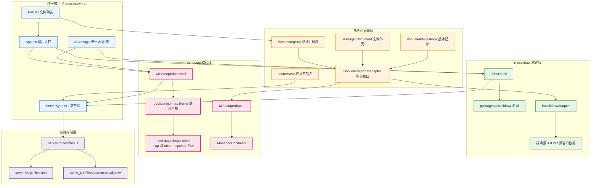

# 项目架构与多格式文件关系梳理

> 这个项目应被理解为“统一文件管理宿主 + 多种格式编辑器”的架构：Excalidraw 与 MindMap 是并列文件格式，统一由文件系统、格式适配器和路由层接入。

## 全景总览

> 上层是统一宿主和文件系统，中层是格式适配器多态接口，下层才是 Excalidraw 与 MindMap 各自的编辑器和源码树。



图解说明：`excalidraw-app` 是宿主应用，不应被理解为只服务 Excalidraw 画布。文件列表、AI 配置、API 客户端、文件路由都属于宿主层。`DocumentFormatAdapter` 是多格式接入的核心接口，Excalidraw 与 MindMap 应作为两个并列 adapter 接入。当前 Excalidraw 因历史原因仍有裸场景 JSON 兼容路径，MindMap 则更接近新的 `ManagedDocument` 模型。后端统一保存文件元数据和 JSON 正文，通过 `files.kind` 区分格式。

主要参考文件：`excalidraw-app/data/documentTypes.ts` 提供 `ManagedDocument`、`DocumentKind` 和遗留 Excalidraw 场景归一化逻辑；`excalidraw-app/data/formats/types.ts` 提供 `DocumentFormatAdapter` 统一多态接口；`excalidraw-app/App.tsx` 提供基于 hash kind 的前端编辑器路由入口；`server/db.js` 提供 `files.kind` 与服务端多格式元数据存储结构。

## 一、建议的架构理解

这个项目目前由三类代码组成：

- 统一宿主：`excalidraw-app/`，负责首页、文件列表、路由、AI 配置、服务端同步、缩略图和不同编辑器挂载。
- 格式实现：`packages/excalidraw/` 与 `mind-map/`，分别提供 Excalidraw 与 MindMap 的实际编辑器能力。
- 后端与部署：`server/`、`docker/`、`Dockerfile.full`、`public/`，负责 API、持久化、静态资源和镜像运行。

更清晰的心智模型是：

```text
统一文件系统
  ├─ 文件元数据：id / name / kind / folder / sort / updated_at
  ├─ 格式多态：DocumentFormatAdapter
  ├─ Excalidraw 文件：kind=excalidraw
  └─ MindMap 文件：kind=mindmap
```

也就是说，Excalidraw 不应该被看作“系统本体”，MindMap 也不应该被看作“外挂小功能”。它们都应是统一文件系统下的格式实现。只是当前仓库历史上从 Excalidraw 单格式演进而来，所以仍保留很多命名和路径上的 Excalidraw 痕迹。

## 二、主要目录职责

### 2.1 根目录

`package.json` 定义 Yarn workspaces，当前包含 `excalidraw-app`、`packages/*`、`examples/*`。需要注意：`mind-map/` 目前不是 workspace，而是通过 `excalidraw-app/package.json` 中的本地路径依赖接入 `mind-map/simple-mind-map`。

`Dockerfile.full` 是完整部署镜像构建文件。它先构建前端，再安装 server 依赖，最后用 nginx 托管静态资源并反代 Node API。

`.dockerignore` 默认排除大多数文件，再白名单放回需要构建的目录。它对 `mind-map/` 和 `public/mind-map/dist/` 的放行很关键，否则 Docker 构建会缺 MindMap 依赖或 iframe 静态资源。

### 2.2 `excalidraw-app/`

这是当前系统的宿主前端应用。它包含文件列表、多格式路由、Excalidraw 编辑器壳、MindMap 编辑器壳、AI 配置和 API 客户端。

关键文件：

- `App.tsx`：根据 URL hash 中的 `file` 和 `kind` 决定打开文件列表、Excalidraw 编辑器或 MindMap 编辑器。
- `components/FileList.tsx`：统一文件列表，负责创建、导入、打开、重命名、移动、下载、删除不同格式文件。
- `EditorShell.tsx`：Excalidraw 编辑器壳，加载 `@excalidraw/excalidraw` 并处理画布初始化、保存、草稿、库和 AI。
- `MindMapEditorShell.tsx`：MindMap 编辑器壳，当前通过 iframe 加载 `/mind-map/index.html`，负责把宿主文件数据和原生 MindMap 应用连接起来。
- `components/AISettings.tsx`：统一 AI 配置窗口，首页、Excalidraw 与 MindMap 应共用。
- `data/ServerSync.ts`：浏览器到 `/api/files` 的统一 API 客户端。

### 2.3 `packages/excalidraw/`

这是 Excalidraw 画布编辑器源码，对应 npm 包 `@excalidraw/excalidraw`。从架构上，它应被看作 Excalidraw 格式的编辑器实现，而不是整个系统的全部。

当前 `EditorShell.tsx` 直接导入并挂载这个包，因此 Excalidraw 编辑路径与宿主耦合较深。这是历史包袱，也是后续要逐步收敛到统一格式接口的地方。

### 2.4 `mind-map/`

这是 MindMap 格式的源码树，和 `packages/excalidraw/` 在产品定位上应是并列关系。

关键目录：

- `mind-map/simple-mind-map/`：MindMap 核心库源码，被 `excalidraw-app` 通过本地路径依赖引用。
- `mind-map/web/`：MindMap 原生 Vue 编辑器工程，提供完整原生界面。
- `mind-map/web/public/index.html`：Vue 工程模板，也是接管模式桥接脚本所在位置。
- `mind-map/web/src/pages/Edit/components/Toolbar.vue`：原生 MindMap 工具栏，是后续放入宿主按钮的正确位置。

### 2.5 `public/mind-map/`

这是 MindMap 原生 Vue 应用构建后的运行时静态资源快照。`MindMapEditorShell.tsx` 通过 iframe 打开的 `/mind-map/index.html` 实际来自这里。

它不是源码的权威位置，而是发布产物。修改 `mind-map/web/` 后必须重新构建并同步到 `public/mind-map/`，否则主应用仍加载旧版 MindMap UI。

### 2.6 `server/`

这是 Node/Express 后端。它不直接理解每种格式的业务结构，而是把文件作为 JSON 文档保存。

关键文件：

- `server/db.js`：定义 SQLite 表，`files.kind` 是区分 Excalidraw、MindMap 等格式的核心字段。
- `server/routes/files.js`：提供文件、文件夹、缩略图、存档相关 API。
- `server/index.js`：组装 Express 服务和路由。

当前磁盘正文路径仍叫 `current.excalidraw`，这只是历史命名，不代表只能保存 Excalidraw。实际区分格式依赖数据库的 `kind` 字段和客户端 adapter。

## 三、多格式文件核心接口

### 3.1 `ManagedDocument`

`excalidraw-app/data/documentTypes.ts` 定义统一文件外壳：

```ts
interface ManagedDocument<T = unknown> {
  kind: DocumentKind;
  containerVersion: number;
  formatVersion: number;
  sourceVersion?: string;
  data: T;
}
```

它的作用是把“文件系统层的通用信息”和“格式自身的数据”分开：

- `kind`：文件格式，例如 `excalidraw`、`mindmap`。
- `containerVersion`：统一文件外壳版本。
- `formatVersion`：具体格式的数据版本。
- `sourceVersion`：上游模块版本，例如 MindMap 的 `simple-mind-map` 版本。
- `data`：格式自身内容。

### 3.2 `DocumentFormatAdapter`

`excalidraw-app/data/formats/types.ts` 定义多态接口：

```ts
interface DocumentFormatAdapter<TData = unknown> {
  kind: DocumentKind;
  currentFormatVersion: number;
  extensions: string[];
  mimeTypes: string[];
  createEmpty(): TData;
  parse(input: Blob | unknown): Promise<TData>;
  serialize(data: TData): Promise<Blob | object | string>;
  migrate(data: unknown, fromVersion: number): TData;
  validate(data: unknown): data is TData;
  toDocument(data: TData): ManagedDocument<TData>;
}
```

新格式应优先实现这个接口，而不是在文件列表、后端或编辑器里硬编码格式判断。这样统一文件系统只依赖 adapter，不需要知道每种格式内部结构。

### 3.3 格式注册表

`excalidraw-app/data/formats/registry.ts` 注册当前格式：

- `ExcalidrawAdapter`
- `MindMapAdapter`
- `TextAdapter`

这是“系统认识哪些格式”的集中入口。后续新增格式时，理想路径是新增 adapter，再注册到 registry。

## 四、Excalidraw 与 MindMap 的并列关系

### 4.1 Excalidraw 格式线

Excalidraw 当前由这些文件组成：

- `packages/excalidraw/`：画布编辑器源码。
- `excalidraw-app/EditorShell.tsx`：宿主编辑器壳。
- `excalidraw-app/data/formats/ExcalidrawAdapter.ts`：格式适配器。
- `excalidraw-app/data/importExcalidrawScene.ts`：Excalidraw 文件导入。
- `excalidraw-app/data/forkFileTypes.ts`：Excalidraw 本地缓存和场景快照类型。

当前 Excalidraw 仍有遗留裸场景 JSON 路径。也就是说，很多地方保存的是 `{ elements, appState, files }` 这样的场景对象，而不是完整 `ManagedDocument`。`normalizeDocument()` 会把旧场景归一成 `kind=excalidraw` 的 Managed 文档，但写入路径还没有完全统一。

### 4.2 MindMap 格式线

MindMap 当前由这些文件组成：

- `mind-map/simple-mind-map/`：核心库源码。
- `mind-map/web/`：原生 Vue 编辑器源码。
- `public/mind-map/`：已构建的 iframe 静态资源。
- `excalidraw-app/MindMapEditorShell.tsx`：宿主编辑器壳。
- `excalidraw-app/data/formats/MindMapAdapter.ts`：格式适配器。
- `excalidraw-app/data/formats/mindMapThumbnail.ts`：MindMap 缩略图生成。

MindMap 当前更接近新架构：它通过 `MindMapAdapter.toDocument()` 保存为 `ManagedDocument<mindmap>`，并记录 `sourceVersion`。

### 4.3 并列关系应如何表达

更理想的并列结构是：

```text
格式实现层
  ├─ excalidraw/
  │   ├─ source: packages/excalidraw
  │   ├─ adapter: ExcalidrawAdapter
  │   └─ editor shell: EditorShell
  └─ mindmap/
      ├─ source: mind-map
      ├─ adapter: MindMapAdapter
      └─ editor shell: MindMapEditorShell
```

当前目录还没有完全按这个概念重排，但文档和后续改造应坚持这个边界：宿主只面向 `kind` 和 adapter；格式内部由各自源码和 editor shell 负责。

## 五、文件打开、保存和导入流程

### 5.1 打开流程

`FileList` 点击文件后调用 `onOpenFile({ id, kind })`。`App.tsx` 把它编码进 URL hash：

```text
#file=<id>                 -> 默认 Excalidraw
#file=<id>&kind=mindmap    -> MindMap
```

然后 `App.tsx` 根据 `kind` 选择：

- `kind=excalidraw`：加载 `EditorShell`。
- `kind=mindmap`：加载 `MindMapEditorShell`。
- 未支持格式：显示 unsupported fallback。

### 5.2 保存流程

前端统一通过 `ServerSync.saveFileImmediate(id, data, name, thumbnail)` 保存。后端把 `data` 写到磁盘 JSON，把 `kind` 保存在数据库 `files` 表。

Excalidraw 保存路径更偏旧架构：

- `EditorShell` 使用 Excalidraw API 读取场景。
- 使用 `hashSceneSnapshot()` 做画布级脏状态判断。
- 保存内容多为裸场景 JSON。

MindMap 保存路径更偏新架构：

- `MindMapEditorShell` 从 iframe 收到原生 MindMap 数据。
- 使用 `MindMapAdapter.toDocument(data)` 包成 Managed 文档。
- 使用 `hashDocumentSnapshot()` 做文档级脏状态判断。

### 5.3 导入流程

`FileList` 使用 `detectFormat()` 判断文件类型。非 Excalidraw 格式更倾向走 adapter：

```text
detectFormat -> getDocumentFormatAdapter -> adapter.parse -> adapter.toDocument -> ServerSync.saveFileImmediate
```

Excalidraw 导入仍有专门路径 `loadExcalidrawFileAsServerSceneData()`，这是历史兼容逻辑。未来如果要彻底统一，可以逐步让 Excalidraw 导入也更多经过 `ExcalidrawAdapter`。

## 六、后端存储模型

服务端的核心模型是：

```text
SQLite files 表
  id
  name
  kind
  folder_id
  sort_index
  content_sha256

磁盘文件
  DATA_DIR/files/<id>/current.excalidraw
  DATA_DIR/files/<id>/archives/*.excalidraw
  DATA_DIR/files/<id>/thumbnail.svg
```

这里有一个容易误解的点：`current.excalidraw` 是历史文件名，不代表只能存 Excalidraw。现在它实际存的是当前文件的 JSON 正文，可能是 Excalidraw 场景，也可能是 MindMap Managed 文档。

后端目前只负责通用文件管理，不负责理解每种格式内部结构。格式解析应在前端 adapter 和 editor shell 中完成。

## 七、当前混乱点

### 7.1 命名仍偏 Excalidraw

很多通用能力仍叫 `excalidraw-file-*`、`current.excalidraw`、`sceneHash`。这些名字来自单格式时代，现在已经承载了多格式职责。短期可以保留，文档里要说明它们是历史命名；长期可以逐步重命名为 `document-*`、`current.document`、`documentHash`。

### 7.2 Excalidraw 与 MindMap 写入形态不一致

Excalidraw 仍常保存裸场景对象，MindMap 保存完整 Managed 文档。这是当前最重要的不一致。

短期策略：通过 `normalizeDocument()` 和 adapter 兼容两种形态。

长期策略：让 Excalidraw 也逐步以 `ManagedDocument<excalidraw>` 作为主要持久化形态，只保留旧文件读取兼容。

### 7.3 `public/mind-map/` 容易被误认为源码

`public/mind-map/` 是运行时静态产物，不是 MindMap 的源码权威位置。源码应看 `mind-map/web/` 和 `mind-map/simple-mind-map/`。

任何原生 MindMap UI 修改都应先改 `mind-map/web/`，再构建同步到 `public/mind-map/`。

### 7.4 adapter 接口已经存在，但不是所有路径都走 adapter

`DocumentFormatAdapter` 是正确方向，但当前 Excalidraw 主路径还有专用导入、专用编辑器、专用缓存和专用哈希。维护时不要误以为修改 adapter 就覆盖所有 Excalidraw 行为。

### 7.5 MindMap 不是 workspace

`mind-map/` 现在不在根 `package.json` workspaces 内，而是通过 `file:../mind-map/simple-mind-map` 被 `excalidraw-app` 引用。Docker 构建时也需要显式复制相关 package 文件。

## 八、建议的后续整理方向

### 8.1 架构命名整理

优先在新文档和新代码里使用这些概念：

- `Document`：统一文件。
- `DocumentKind`：格式类型。
- `DocumentFormatAdapter`：格式多态接口。
- `EditorShell`：某格式的编辑器宿主。
- `SourceVersion`：上游格式模块版本。

旧命名如 `scene`、`excalidraw-file`、`current.excalidraw` 暂时保留，但应标注为历史命名。

### 8.2 格式并列整理

后续新格式接入时，建议按同样结构补齐：

```text
格式源码或依赖
格式 Adapter
格式 EditorShell
格式 thumbnail 生成
格式导入/导出规则
格式版本记录
```

这样 Excalidraw、MindMap、未来 Text、Excel 或其他格式都可以通过统一宿主引用。

### 8.3 持久化形态统一

长期目标是服务端保存的 `data` 都是：

```text
ManagedDocument<TData>
```

Excalidraw 的旧裸场景 JSON 只作为读取兼容路径存在。这样迁移、哈希、下载、导入、版本比较都会更清晰。

### 8.4 目录关系建议

概念上建议把目录理解为：

```text
excalidraw-app/        统一宿主应用
packages/excalidraw/   Excalidraw 格式实现
mind-map/              MindMap 格式实现
public/mind-map/       MindMap 发布产物
server/                通用文件系统后端
```

如果未来要进一步整理目录，可以考虑新增 `formats/` 或 `modules/` 作为概念层，但当前不建议马上大规模搬目录，先通过文档和 adapter 边界稳定架构。

## 九、维护约定

新增格式时必须回答以下问题：

1. `kind` 是什么？
2. adapter 放在哪里，是否注册到 `formats/registry.ts`？
3. 数据是否保存为 `ManagedDocument`？
4. 编辑器入口是什么，`App.tsx` 如何路由？
5. 缩略图如何生成？
6. 导入和下载如何序列化？
7. 上游源码版本如何记录？
8. Docker 或静态资源是否需要额外同步？

只有这八项明确后，新格式才算真正接入统一文件系统，而不是临时嵌入一个编辑器页面。
