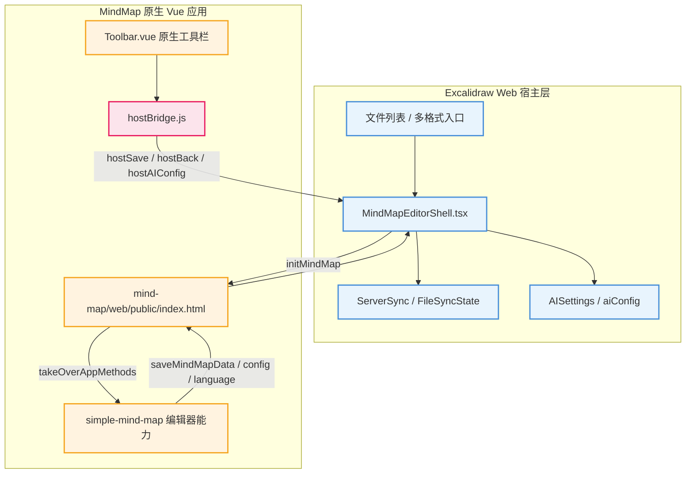

# MindMap 原生 UI 适配功能修改清单

> 目标是在不重做 MindMap 原生界面的前提下，把当前系统需要的文件管理、保存、返回和 AI 配置能力嵌入原生工具栏，让 MindMap 与 Excalidraw 在文件系统中保持对等地位。

## 全景总览

> 整体改造应以原生 MindMap Vue 应用为 UI 主体，React 宿主只负责文件系统、AI 配置弹窗和跨 iframe 通信。

图解说明：上半部分是当前 Excalidraw Web 的宿主能力，负责文件读取、保存、脏状态、缩略图和 AI 配置；下半部分是 MindMap 原生 Vue 应用，负责完整编辑体验。`public/index.html` 是 iframe 接管入口，`hostBridge.js` 是推荐新增的原生端通信工具，`Toolbar.vue` 是宿主按钮应该出现的位置。数据流从宿主初始化到原生编辑器，编辑变更再回传给宿主保存，避免在 React 侧重做 MindMap UI。

主要参考文件：`Notion-Boost-browser-extension/components/features/mindMapEmbed.ts` 提供插件版宿主侧 iframe、保存、关闭、草稿和历史消息处理思路；`Notion-Boost-browser-extension/.output/chrome-mv3/mindmap-web/index.html` 提供插件版内嵌 MindMap 页面按钮与 `postMessage` 设计参考。

## 一、当前问题

当前 MindMap 已经通过 iframe 加载原生页面，但文件系统相关操作仍然放在 React 悬浮层中。这样虽然恢复了原生编辑器主体，但“返回文件列表、AI 设置、保存到文件、状态提示”等按钮没有融入原生工具栏，视觉和交互上仍然像外置补丁。

Notion 插件版的做法值得参考：它把 Close、Stash、History、Save & Close 等宿主按钮放进 MindMap 页面内部，并通过 `postMessage` 把操作交给外层宿主处理。当前项目不建议照搬插件版的 DOM 注入，因为我们拥有 MindMap 源码，应直接修改 Vue 原生组件，减少运行时注入的不确定性。

## 二、需要修改的功能

### 2.1 原生工具栏增加宿主操作按钮

在 `mind-map/web/src/pages/Edit/components/Toolbar.vue` 中新增一组“宿主操作”按钮，而不是继续依赖 `excalidraw-app/MindMapEditorShell.tsx` 的悬浮层。

需要加入的按钮：

- `返回文件列表`：通知宿主退出 MindMap 编辑器，回到文件列表。
- `保存到文件`：通知宿主请求原生编辑器导出最新数据并保存到当前文件。
- `AI 设置`：通知宿主打开统一 AI 配置窗口，保持 Excalidraw 与 MindMap 共用同一配置入口。
- 可选 `保存并返回`：参考 Notion 插件版的 Save & Close，把保存和退出合并为一个高频操作。

按钮样式应复用原生 `.toolbarBtn` 结构，使用现有 iconfont 或短文本，避免新增一套独立视觉体系。按钮位置建议放在导入、导出同一工具栏块附近，因为这些按钮同属文件和宿主操作。

这些按钮只应在宿主接管模式下显示，也就是 `window.takeOverApp === true` 且页面运行在 iframe 宿主中时显示；原生 MindMap 独立运行时仍保留自己的本地文件、导入、导出能力，不显示 Excalidraw Web 专属按钮。

需要注意原生工具栏会根据宽度动态计算 `horizontalList` 和 `verticalList`。宿主按钮如果不进入 `ToolbarNodeBtnList` 的自适应列表，就要确认它们不会挤压原生按钮；如果进入自适应列表，则需要同步扩展 `ToolbarNodeBtnList.vue` 对新按钮类型的渲染。

### 2.2 新增原生端宿主通信工具

新增 `mind-map/web/src/utils/hostBridge.js`，集中判断当前是否运行在 Excalidraw Web 宿主中，并统一发送消息。

建议消息类型：

- `hostBackToFiles`：返回文件列表。
- `hostRequestSave`：保存当前 MindMap 到文件系统。
- `hostOpenAISettings`：打开统一 AI 设置窗口。
- `hostSaveAndBack`：保存后返回文件列表。
- `hostReadyForCommands`：原生 UI 已就绪，可选，用于宿主同步状态或 AI 配置状态。

这能避免在 `Toolbar.vue` 里散落 `window.parent.postMessage`，后续如果还要接入历史、草稿、分享或权限能力，也可以只扩展这个桥接模块。

`hostBridge.js` 至少应提供：

- `isHostMode()`：判断是否处于 Excalidraw Web 宿主接管模式。
- `postHostCommand(type, payload)`：统一发送 `source === "simple-mind-map-native"` 的消息。
- 语义化方法：`backToFiles()`、`requestSave()`、`openAISettings()`、`saveAndBack()`。

发送目标可以继续用 `window.parent.postMessage`，但消息格式必须与 `MindMapEditorShell.tsx` 的类型定义保持一致。

### 2.3 宿主侧处理原生工具栏消息

在 `excalidraw-app/MindMapEditorShell.tsx` 扩展 `NativeMindMapMessage`，接收原生工具栏发来的宿主操作消息。

需要处理：

- 收到 `hostBackToFiles` 后执行 `window.location.hash = ""`。
- 收到 `hostOpenAISettings` 后执行 `setShowAISettings(true)`。
- 收到 `hostRequestSave` 后向 iframe 发送 `requestMindMapSave`，由原生编辑器回传 `saveMindMapData` 后再保存。
- 收到 `hostSaveAndBack` 后先保存，保存成功后返回文件列表。

保存流程要继续复用现有 `MindMapAdapter.toDocument`、`hashDocumentSnapshot`、`FileSyncState`、`ServerSync.saveFileImmediate` 和 `buildMindMapThumbnailSvg`，不要在原生端直接访问当前系统的后端。

宿主侧还需要补齐“请求保存”和“保存成功”的异步握手。当前 `requestMindMapSave` 只触发原生端回传 `saveMindMapData`，真正保存发生在宿主收到数据后。因此 `hostSaveAndBack` 不能在发出请求后立刻返回，应该等待 `ServerSync.saveFileImmediate` 成功后再返回文件列表；失败时保留在编辑器并展示错误。

### 2.4 移除 React 悬浮工具条

当原生工具栏承载返回、保存、AI 设置后，`MindMapEditorShell.tsx` 中的 `.mindmap-editor__overlay` 应删除或降级为不可交互状态提示。

建议保留：

- iframe 容器。
- `AISettings` 弹窗。
- 错误提示。
- 必要的隐藏状态文本或开发调试状态。

建议移除：

- React 层 `返回文件列表` 按钮。
- React 层 `AI 设置` 按钮。
- React 层 `保存到文件` 按钮。
- 对应的 `.mindmap-editor__primary`、`.mindmap-editor__secondary`、`.mindmap-editor__ai-button` 等样式。

### 2.5 完善 iframe 接管入口

`mind-map/web/public/index.html` 目前已经设置 `window.takeOverApp = true`，并实现 `initMindMap`、`requestMindMapSave`、`saveMindMapData`、`saveMindMapConfig`、`saveLocalConfig`、`saveLanguage` 等桥接能力。

需要补充或确认：

- 保存请求必须从原生 `mindMap.getData(true)` 获取完整数据后再回传宿主。
- 对宿主消息校验 `source === "excalidraw-web"`。
- 对发给宿主的消息统一使用 `source === "simple-mind-map-native"`。
- 如果新增 `hostSaveAndBack`，需要确保宿主能区分普通保存和保存后返回。

该文件是 Vue 构建模板，修改后必须重新构建 MindMap 原生应用，并同步生成后的 `public/mind-map/index.html` 与 `public/mind-map/dist/`。

还需要关注 `mind-map/web/src/api/index.js` 中的接管模式逻辑。当前 `getData()`、`storeData()`、`storeConfig()`、`storeLang()`、`storeLocalConfig()` 已经通过 `window.takeOverAppMethods` 工作；如果新增宿主命令，不应破坏这些原生数据读写入口。

### 2.6 AI 配置状态同步

MindMap 的 AI 配置窗口仍由 Excalidraw Web 宿主提供，原生工具栏只发送“打开配置窗口”的意图。这样可以保证首页、Excalidraw 和 MindMap 使用同一套 `AISettings` 与 `aiConfig`。

后续如果要在 MindMap 原生工具栏显示 AI 是否已配置，可以增加 `aiConfigStatus` 消息：

- 宿主在 AI 配置加载或变化后发给 iframe。
- 原生端在 `Toolbar.vue` 中显示绿色状态点或提示文本。

这一项不是第一阶段必须功能，第一阶段只要求 `AI 设置` 能从原生工具栏打开统一弹窗。

如果原生 MindMap 自带 AI 功能仍读取自己的 `localConfig.enableAi`，需要确认“原生 AI 功能开关”和“宿主 AI 设置入口”不是同一个概念。第一阶段只接入宿主统一配置窗口，不改写原生 AI 生成逻辑。

### 2.7 构建与产物同步

MindMap 原生 UI 的源码位于 `mind-map/web/`，运行时静态资源位于 `public/mind-map/`。因为主应用实际加载的是 `/mind-map/index.html`，所以只改源码不够。

每次修改原生 Vue UI 后需要执行：

1. 在 `mind-map/web` 构建原生 MindMap 应用。
2. 若遇到 OpenSSL 兼容问题，使用 `NODE_OPTIONS=--openssl-legacy-provider`。
3. 将构建结果同步到 `public/mind-map/`。
4. 确认 Docker 构建上下文没有通过 `.dockerignore` 排除 `mind-map/` 和 `public/mind-map/dist/`。

### 2.8 多语言文案与原生样式

如果按钮文字使用 `$t('toolbar.xxx')`，需要同步修改原生语言文件：

- `mind-map/web/src/lang/zh_cn.js`
- `mind-map/web/src/lang/en_us.js`
- `mind-map/web/src/lang/zh_tw.js`
- `mind-map/web/src/lang/vi_vn.js`

如果第一阶段只面向中文，也可以先在 `Toolbar.vue` 使用固定中文短文案，但最终仍建议补齐 i18n，避免切换语言后出现空文案。

样式上优先复用 `.toolbarBtn`、`.toolbarBlock`、`.iconfont` 和原生暗色模式类，不新增独立悬浮样式。若需要区分宿主按钮，可以增加很小范围的 `hostToolbarBlock` 或 `hostToolbarBtn` class，但必须继承原生按钮尺寸、间距和 hover 规则。

### 2.9 验证脚本与实验文档

当前仓库已有多格式和 MindMap 相关验证脚本，修改 UI 接入后需要更新与当前实现强相关的校验，避免旧脚本继续检查已经被移除的 React 工具条或旧的直接库接入方式。

重点检查：

- `experiments/p0-4-mindmap-react-vite-shell/validate.mjs`
- `experiments/p2-2-mindmap-adapter-mvp/validate.mjs`
- `experiments/p2-5-shared-ai-settings/validate.mjs`
- `experiments/p2-4-complete-todo-list/validate.mjs`

如果这些脚本仍以“React 悬浮按钮存在”作为通过条件，应改为检查 iframe 原生 UI、宿主消息处理、AISettings 仍由宿主打开、以及构建产物存在。

## 三、建议实施顺序

1. 新增 `mind-map/web/src/utils/hostBridge.js`，定义宿主模式判断、消息类型和发送函数。
2. 修改 `Toolbar.vue`，在宿主模式下把返回、保存、AI 设置等按钮加入原生工具栏。
3. 必要时修改 `ToolbarNodeBtnList.vue`，让宿主按钮参与原生工具栏自适应收纳。
4. 修改 `mind-map/web/src/lang/*`，补齐宿主按钮的多语言文案。
5. 修改 `MindMapEditorShell.tsx`，处理原生工具栏消息并复用现有保存流程。
6. 为 `hostSaveAndBack` 增加保存成功后再返回的异步确认逻辑。
7. 精简 `MindMapEditorShell.scss`，删除 React 悬浮工具条相关样式。
8. 检查 `mind-map/web/public/index.html` 和 `mind-map/web/src/api/index.js` 的接管桥接，必要时补充新消息且不破坏原生数据读写入口。
9. 重新构建 MindMap 原生应用，同步 `public/mind-map/`。
10. 更新相关实验验证脚本，确保校验目标与原生 UI 接入方式一致。
11. 运行类型检查或针对 MindMap 打开、编辑、保存、保存并返回、返回、AI 设置的人工验证。

## 四、验收标准

- 打开 MindMap 文件后，用户看到的是 MindMap 原生 Vue 编辑器，而不是 React 重新实现的简化界面。
- 返回、保存、AI 设置等系统按钮出现在原生 MindMap 工具栏中，视觉上复用原生按钮风格。
- 保存按钮能保存当前 MindMap 最新数据，包括节点、主题、布局、配置、语言和本地配置。
- 保存并返回按钮必须在宿主保存成功后再退出，保存失败时停留在当前编辑器。
- AI 设置从 MindMap 原生工具栏打开，并与首页、Excalidraw 共用同一配置。
- React 层不再显示覆盖原生 UI 的悬浮工具条。
- 原生 MindMap 独立运行时不显示 Excalidraw Web 专属宿主按钮。
- 宿主按钮在不同窗口宽度下不挤压或破坏原生工具栏布局。
- Docker 构建能找到 `mind-map/simple-mind-map` 依赖和 `public/mind-map/dist/` 静态资源。
- 修改后至少验证：打开旧 MindMap 文件、新建 MindMap 文件、编辑节点、保存、刷新恢复、返回文件列表、打开 AI 设置。

## 五、暂不建议做的事项

- 不建议复制 Notion 插件版的 DOM 注入实现。插件版只能修改构建产物，所以需要运行时插按钮；当前项目拥有源码，应修改 `Toolbar.vue`。
- 不建议在 React 侧继续扩展 MindMap 编辑按钮。节点、导入、导出、主题、样式、AI 等编辑能力都应由原生 MindMap 承担。
- 不建议让 MindMap 原生端直接调用 Excalidraw Web 后端。原生端只表达操作意图和回传编辑数据，文件系统边界仍由宿主统一管理。
