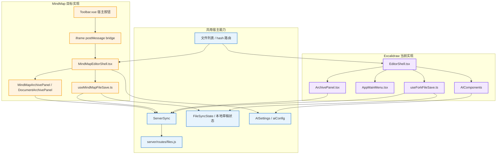
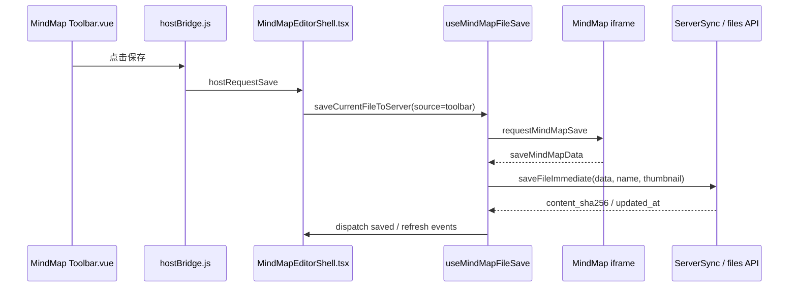
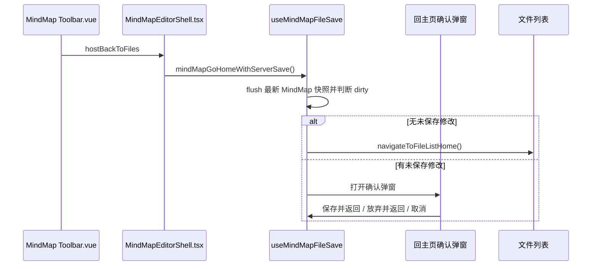
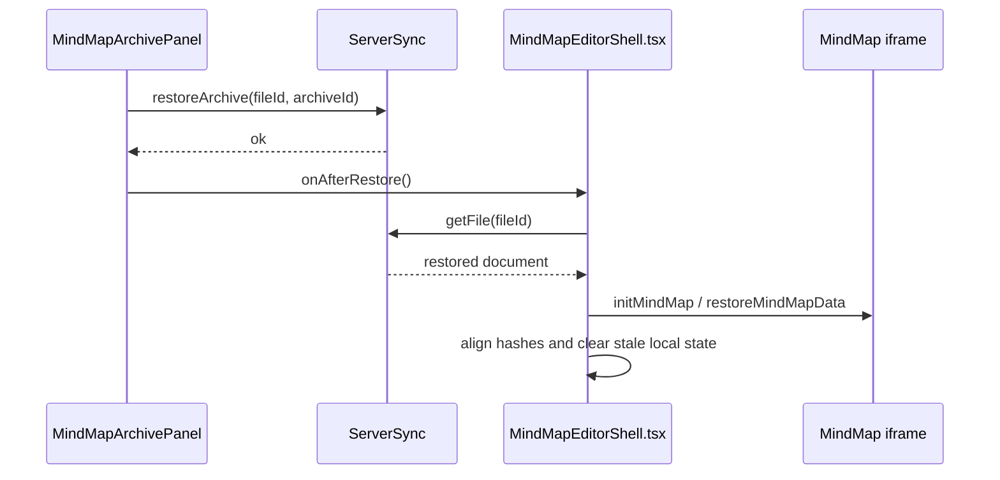

# MindMap 对齐 Excalidraw 文件能力架构设计

> 目标是先把 Excalidraw 已经跑通的文件能力完整梳理清楚，再让 MindMap 按同一职责模型接入，而不是只复制几个按钮或局部保存代码。

## 全景总览

> Excalidraw 的文件能力不是单点实现，而是由编辑器壳、保存 Hook、历史面板、菜单入口、AI 组件、同步状态和服务端归档共同组成；MindMap 应按同样分层实现。

图解说明：左上是两个格式都应共用的宿主能力，包括文件列表入口、服务端同步、本地草稿状态、AI 配置和后端文件 API。左下是 Excalidraw 已有实现，它通过 `EditorShell.tsx` 把保存、历史、菜单和 AI 组合进 Excalidraw 组件。右下是 MindMap 的目标形态：React 宿主壳仍负责文件系统，Vue 原生工具栏只发起宿主命令，真正保存、历史、回主页和 AI 配置仍落在宿主层，保证 Excalidraw 与 MindMap 在系统中是并列文件格式。

## 一、Excalidraw 当前职责拆分

### 1.1 编辑器壳：`EditorShell.tsx`

`excalidraw-app/EditorShell.tsx` 是 Excalidraw 文件编辑器的组合入口。它不只渲染画布，还负责把文件系统能力挂到 Excalidraw 的扩展点上。

主要职责包括：

- 通过 `getFileIdFromHash()` 判断当前是否处于服务器文件编辑模式。
- 通过 `renderTopRightUI` 注入右上角“保存”和“主页”按钮。
- 将 `AppMainMenu` 注入 Excalidraw 主菜单，提供“保存到服务器、返回首页、历史版本”等入口。
- 在 `ArchivePanel` 恢复历史版本后调用 `reloadSceneFromServer()` 重新加载服务端快照。
- 在 `onChange` 中保存本地数据，并触发草稿 hash 更新。
- 在 `onIncrement` 中记录 durable delta，支持本地编辑状态和恢复。
- 渲染 `AIComponents`，接入 Excalidraw 原生 AI 插件。
- 渲染“返回文件列表”确认弹窗，让用户在保存、放弃、取消之间选择。

### 1.2 保存 Hook：`useForkFileSave.ts`

`excalidraw-app/hooks/useForkFileSave.ts` 是 Excalidraw 文件能力最核心的编排层。它把 UI 事件、草稿状态、服务端保存和回主页流程收敛在一个 Hook 中。

保存链路包括：

- `updateDraftHashDebouncedRef`：编辑时防抖计算草稿 hash，并更新 `FileSyncState`。
- `persistLocalDraftToCache()`：离开或上传失败时，将当前场景、二进制文件、delta 和缩略图写入本地缓存。
- `saveCurrentFileToServer()`：保存到服务器，生成缩略图，调用 `ServerSync.saveFileImmediate()`，对齐 hash，并触发文件列表刷新事件。
- `forkGoHomeWithServerSave()`：回主页前先 flush 草稿状态，如果有未保存修改就打开确认弹窗。
- `forkHomeConfirmSave()`：保存并返回。
- `forkHomeConfirmDiscard()`：放弃本地修改并返回。
- `skipLeaveStashOnceRef`：避免已经被“保存并返回”或“放弃并返回”处理过的离开动作再次触发自动暂存。

这个 Hook 的价值在于：所有离开编辑器前的决策都经过同一套 dirty 判断和保存策略，不会出现顶栏、菜单、快捷键、hash 离开各自保存一遍的分叉。

### 1.3 历史版本：`ArchivePanel.tsx`

`excalidraw-app/components/ArchivePanel.tsx` 是历史版本 UI。它本身不理解 Excalidraw 场景结构，只依赖文件 ID 和 `ServerSync`。

主要职责包括：

- 调用 `ServerSync.listArchives(fileId)` 获取服务端历史版本。
- 显示“本地草稿”状态，使用 `FileSyncState.hasUnsavedChanges(fileId)` 判断是否未保存。
- 监听 `excalidraw-server-saved` 事件，在保存成功后静默刷新版本列表。
- 点击恢复时调用 `ServerSync.restoreArchive(fileId, archiveId)`。
- 恢复成功后调用外部传入的 `onAfterRestore()`，由编辑器壳决定如何重新加载画布。

这说明历史面板天然可以向多格式复用方向演进。真正格式相关的是“恢复后如何刷新编辑器内容”，不在历史面板内部。

### 1.4 主菜单：`AppMainMenu.tsx`

`excalidraw-app/components/AppMainMenu.tsx` 在 Excalidraw 原生菜单中加入宿主文件能力。

它保留 Excalidraw 默认菜单项，同时增加：

- `保存到服务器`：调用 `onSaveToServer`。
- `返回首页`：调用 `onGoHome`。
- `历史版本`：调用 `onToggleHistory`。

MindMap 不一定有同名 React 菜单，但需要在原生 Vue 工具栏中提供同等入口，并且入口最终调用宿主层同一组命令。

### 1.5 AI：`AIComponents.tsx` 与 `AISettings.tsx`

Excalidraw AI 分为两层。

第一层是统一配置：

- `AISettings` 是全局配置窗口。
- 配置由 `aiConfig.ts` 读写服务器。
- 首页、Excalidraw 和 MindMap 应共享同一套配置。

第二层是 Excalidraw 编辑器内的能力：

- `DiagramToCodePlugin`：把选中 frame 导出为图片，调用视觉模型生成 HTML。
- `TTDDialog`：文本生成图，调用 OpenAI 兼容流式接口。

MindMap 对齐时，最先要保证的是共享 `AISettings` 配置入口；至于 MindMap 原生 AI 能力，可以在后续通过 Vue 原生按钮或宿主命令接入，但不应另起一套配置系统。

### 1.6 离开保护与快捷键

Excalidraw 还有两个配套 Hook。

`useForkKeyboardShortcuts.ts` 监听 `Ctrl+S / Cmd+S`，在当前 hash 指向服务器文件时触发 `saveToServerRef.current({ source: "hotkey" })`。

`useBeforeUnloadGuard.ts` 在浏览器关闭或刷新前执行两件事：

- 先 flush 嵌入式文件和草稿 hash，保证 dirty 判断可信。
- 如果存在未保存修改，尽量写入 `FileSyncState` 本地缓存。
- 如果仍有 Excalidraw 文件存储未完成，则触发浏览器 unload 提示。

MindMap 对齐时也应具备快捷键保存和关闭页面前本地暂存能力。由于 MindMap 内容在 iframe 内，宿主需要先向 iframe 请求最新数据，再完成本地缓存或服务端保存。

### 1.7 服务端归档

服务端文件 API 位于 `server/routes/files.js`。保存时 `PUT /api/files/:id` 会执行以下逻辑：

- 如果提交内容与当前磁盘内容 hash 一致，跳过数据写入和版本记录。
- 如果内容变化，写入 `current.excalidraw` 路径下的当前数据。
- 调用 `appendVersionSnapshot(id, req.body.data)` 追加历史版本。
- 写入缩略图和缩略图元数据。
- 更新 `files.updated_at` 与 `files.content_sha256`。

因此历史版本的真正来源是“服务端保存快照”。前端不应该绕开 `ServerSync.saveFileImmediate()` 另建一套 MindMap 历史机制。

## 二、MindMap 对齐目标

MindMap 应对齐的是 Excalidraw 的文件能力模型，而不是 Excalidraw 的 React UI 细节。

目标拆分如下：

- MindMap 与 Excalidraw 一样，从文件列表进入编辑器。
- MindMap 原生 Vue 工具栏提供“保存、主页、历史版本、AI 设置”入口。
- Vue 工具栏不直接访问服务器，只通过 `postMessage` 通知 React 宿主。
- React 宿主通过 `MindMapEditorShell.tsx` 统一处理保存、回主页、历史、AI 配置。
- 保存 Hook 对齐 `useForkFileSave.ts` 的语义，包括草稿 hash、本地缓存、服务端保存、保存成功事件、失败降级和回主页决策。
- 历史版本复用服务端 archives，不新建 MindMap 专属历史表。
- AI 配置继续共用 `AISettings` 和 `aiConfig.ts`。

## 三、建议的 MindMap 文件结构

建议新增或调整以下职责边界。

### 3.1 `MindMapEditorShell.tsx`

继续作为 MindMap React 宿主壳，职责与 `EditorShell.tsx` 对齐。

它应该负责：

- 根据文件 ID 加载服务器 MindMap 文档。
- 初始化 iframe，并把当前 MindMap 数据发给原生 Vue 应用。
- 监听 Vue 端的宿主命令：保存、主页、保存并返回、历史版本、AI 设置。
- 组合 `useMindMapFileSave`、历史面板、AI 配置窗口和确认弹窗。
- 处理历史恢复后的重新加载，并向 iframe 下发恢复后的 MindMap 数据。

### 3.2 `useMindMapFileSave.ts`

建议新建 MindMap 专属保存 Hook，结构尽量对齐 `useForkFileSave.ts`。

它应该包含：

- `mindMapSaving`：保存中的 UI 状态。
- `mindMapSaveHint`：保存结果提示。
- `mindMapHomeNavDialogOpen`：回主页确认弹窗状态。
- `updateDraftHashDebouncedRef`：防抖更新 MindMap 文档 hash。
- `persistLocalDraftToCache()`：把 MindMap 最新数据写入 `FileSyncState` 本地缓存。
- `saveCurrentFileToServer()`：请求 iframe 导出最新数据，生成缩略图，保存到服务器。
- `mindMapGoHomeWithServerSave()`：回主页前执行 dirty 判断。
- `mindMapHomeConfirmSave()`：保存并返回。
- `mindMapHomeConfirmDiscard()`：放弃本地修改并返回。

与 Excalidraw 的差异只应该在“如何取得当前编辑器快照”：

- Excalidraw 直接通过 `excalidrawAPI.getSceneElementsIncludingDeleted()`、`getAppState()`、`getFiles()` 取数据。
- MindMap 需要通过 iframe bridge 请求原生 Vue 应用导出 `MindMapData`。

需要特别注意：当前 `MindMapEditorShell.tsx` 已经存在 `schedulePersist()` 自动保存到服务器，以及 `mindmap-local-cache-${fileId}` 自定义本地缓存。它们与 Excalidraw 当前“显式保存为主、离开前询问、本地草稿只作兜底”的模型不完全一致。对齐时应把 MindMap 的保存语义收敛到 `useMindMapFileSave.ts`：

- 原生编辑变更可更新草稿 hash 和本地缓存，但不应默认在 1.2 秒后自动上传服务器。
- 用户点击保存、快捷键保存、保存并返回、visibility 保存时才触发 `ServerSync.saveFileImmediate()`。
- 本地缓存 key 应尽量使用 `FileSyncState.localCacheKey(fileId)`，避免长期维护 `mindmap-local-cache-${fileId}` 这套平行状态；如需兼容旧缓存，应只在读取阶段兼容并在成功迁移后清理。
- iframe 保存请求应有并发与超时保护。若已经有一个显式保存请求在等待 `saveMindMapData`，新的请求应复用或失败提示，不能覆盖 `saveResolveRef` 导致前一个 Promise 永远不结束。
- 保存成功事件短期继续触发 `excalidraw-server-saved`，以兼容现有 `ArchivePanel`；后续再补充格式无关的 `document-server-saved`。

### 3.3 `hostBridge.js` 与 `Toolbar.vue`

MindMap 原生侧只负责发起命令，不保存服务器文件。

原生工具栏按钮建议包括：

- `保存`：发送 `hostRequestSave`。
- `主页`：发送 `hostBackToFiles`，宿主再决定是否弹出保存确认。
- `保存并返回`：发送 `hostSaveAndBack`。
- `历史版本`：发送 `hostOpenHistory`。
- `AI 设置`：发送 `hostOpenAISettings`。

这些按钮只在宿主接管模式下显示。独立运行的 simple-mind-map 应保持原生行为。

### 3.4 历史面板

短期可以创建 `MindMapArchivePanel`，内部大部分逻辑复制 `ArchivePanel`。

更长期建议抽成通用 `DocumentArchivePanel`：

- 输入 `fileId`。
- 输入 `onAfterRestore`。
- 输入 `onClose`。
- 输入用于判断未保存状态的 adapter 或回调。

这样 Excalidraw 和 MindMap 只负责恢复后的刷新逻辑，历史列表和恢复按钮可以共用。

需要补充一个样式边界：当前 `ArchivePanel` 的历史面板样式定义在 `.excalidraw .nb-history-panel` 作用域下。MindMap 页面没有 `.excalidraw` 根节点，直接复用组件会导致样式不生效。因此短期实现有两种选择：

- 给 `MindMapEditorShell` 根节点增加能承载同款历史样式的作用域，例如在 `MindMapEditorShell.scss` 复制必要的 `.nb-history-*` 样式。
- 或先抽出格式无关的 `DocumentArchivePanel.scss`，让 Excalidraw 与 MindMap 都引用同一份样式。

短期为了减少改动范围，可以先在 `MindMapEditorShell.scss` 内补齐 MindMap 侧样式；长期再抽公共样式。

### 3.5 AI 配置入口

MindMap 应继续使用 `AISettings`。

推荐流程：

- Vue 工具栏点击 `AI 设置`。
- `hostBridge.js` 发送 `hostOpenAISettings`。
- `MindMapEditorShell.tsx` 设置 `showAISettings=true`。
- `AISettings` 从 `aiConfig.ts` 读取和保存配置。
- 保存后宿主向 iframe 发送 `aiConfigStatus`，让原生 UI 更新可用状态。

## 四、关键交互流程

### 4.1 保存

图解说明：MindMap 的原生按钮只是用户入口，真正保存仍在 React 宿主 Hook 中完成。Hook 先请求 iframe 导出最新数据，再通过与 Excalidraw 相同的 `ServerSync` 保存到服务端，保存成功后同步 hash、刷新文件列表和历史面板。

### 4.2 回主页

图解说明：MindMap 不应该点击主页就直接清空 hash。它应复制 Excalidraw 的离开决策：先确认是否有未保存修改，再由用户决定保存、放弃或继续编辑。

### 4.3 历史恢复

图解说明：历史面板只负责调用恢复 API。恢复后的数据如何应用到编辑器，由对应格式的 Shell 决定。Excalidraw 调 `excalidrawAPI.updateScene()`，MindMap 应向 iframe 下发恢复后的 MindMap 数据。

## 五、与现有 MindMap 原生 UI 方案的关系

本文档不替代 [[MindMap原生UI适配功能修改清单]]，而是补充“文件能力要如何对齐 Excalidraw”。

两份文档的边界如下：

- `MindMap原生UI适配功能修改清单`：重点是原生 Vue UI 如何接入宿主按钮，避免 React 悬浮层破坏原生体验。
- 本文档：重点是保存、历史、回主页、AI、快捷键、离开保护和服务端归档如何按 Excalidraw 模型完整对齐。

如果只完成原生按钮，而没有对齐保存 Hook、dirty 判断、历史恢复和 AI 配置状态，MindMap 仍然只是“有按钮”，还没有真正成为与 Excalidraw 对等的文件格式。

## 六、实施清单

建议按以下顺序实施。

### 6.1 第一阶段：补齐命令入口

- 在 `hostBridge.js` 增加 `hostOpenHistory`。
- 在 `Toolbar.vue` 增加“历史版本”宿主按钮。
- 在 `MindMapEditorShell.tsx` 监听 `hostOpenHistory` 并显示历史面板。
- 保持 `保存、主页、保存并返回、AI 设置` 仍由宿主处理。

验收标准：MindMap 原生工具栏能看到与 Excalidraw 文件能力等价的宿主入口。

### 6.2 第二阶段：抽出 MindMap 保存 Hook

- 新建 `useMindMapFileSave.ts`。
- 将当前 `MindMapEditorShell.tsx` 中保存、保存并返回、提示、保存中状态迁移到 Hook。
- Hook 暴露的函数命名和语义对齐 `useForkFileSave.ts`。
- 将 iframe 导出最新数据封装为 Hook 依赖，而不是散落在 Shell 中。
- 移除或改造当前 1.2 秒自动上传服务器逻辑，避免 MindMap 与 Excalidraw 的保存语义分叉。
- 为 iframe 保存请求增加超时与并发保护，避免原生端无响应时“保存中”状态卡死。

验收标准：保存、保存并返回、失败暂存和保存提示集中在一个 Hook，Shell 只负责组合 UI。

### 6.3 第三阶段：对齐回主页确认

- MindMap 点击主页时不直接 `window.location.hash = ""`。
- 先通过 Hook 请求最新数据并刷新 dirty hash。
- 无修改时直接回主页。
- 有修改时显示与 Excalidraw 同语义的确认弹窗。
- 支持“保存并返回、不保存并返回、取消继续编辑”。

验收标准：MindMap 与 Excalidraw 的回主页行为一致，用户不会因误点主页丢失编辑。

### 6.4 第四阶段：补齐历史版本

- 先实现 `MindMapArchivePanel`，复用 `ArchivePanel` 的交互和样式。
- 恢复后由 `MindMapEditorShell.tsx` 调 `ServerSync.getFile()` 并向 iframe 重新下发数据。
- 保存成功后监听通用保存事件刷新历史列表。
- 后续再评估抽成 `DocumentArchivePanel`。

验收标准：MindMap 可以查看历史版本、恢复历史版本，并在恢复后刷新原生画布。

### 6.5 第五阶段：补齐快捷键和离开保护

- `Ctrl+S / Cmd+S` 在 MindMap 编辑状态下触发宿主保存。
- 浏览器关闭或刷新前，宿主请求 iframe 导出最新数据并写入本地缓存。
- hash 离开时自动暂存未保存修改。
- 已经由保存并返回或放弃返回处理的离开，不重复暂存。

验收标准：MindMap 的热键保存、关闭保护、hash 离开暂存与 Excalidraw 同等级。

### 6.6 第六阶段：对齐 AI 状态

- MindMap AI 设置入口继续打开 `AISettings`。
- `AISettings` 保存后通过宿主向 iframe 发送 `aiConfigStatus`。
- MindMap 原生 UI 根据 AI 是否已配置显示状态。
- 如果后续接 MindMap 原生 AI 能力，也必须读取 `aiConfig.ts` 的统一配置，不另建配置窗口。

验收标准：首页、Excalidraw、MindMap 看到的是同一套 AI 配置，MindMap 原生 UI 能反映配置状态。

## 七、验收标准

最终对齐完成后，应满足以下标准：

- Excalidraw 和 MindMap 都能从文件列表进入、保存、返回首页、查看历史、恢复历史。
- 两者回主页前都执行未保存修改判断。
- 两者保存成功后都刷新文件列表、历史面板和本地 hash 状态。
- 两者都能使用统一 AI 设置窗口。
- MindMap 原生 UI 不被 React 悬浮层覆盖，宿主按钮位于 Vue 原生工具栏内。
- MindMap 不绕开 `ServerSync` 和服务端 archives，不单独实现另一套历史系统。
- MindMap 的本地草稿、失败暂存、快捷键保存和离开保护与 Excalidraw 保持同等语义。

## 八、后续重构方向

当 MindMap 对齐完成后，可以进一步抽象通用能力：

- 把 `ArchivePanel` 抽成 `DocumentArchivePanel`。
- 把保存 Hook 中与格式无关的 hash、事件、导航、错误提示逻辑抽成 `useDocumentFileSave`。
- 由 `DocumentFormatAdapter` 提供格式相关能力，例如 `getSnapshot()`、`hashSnapshot()`、`buildThumbnail()`、`restoreSnapshot()`。
- 把 `excalidraw-server-saved` 这类事件逐步改名为格式无关的 `document-server-saved`，保留兼容事件直到调用点迁移完成。

这些重构应在 MindMap 行为稳定后进行，避免在功能尚未对齐时过早抽象。
