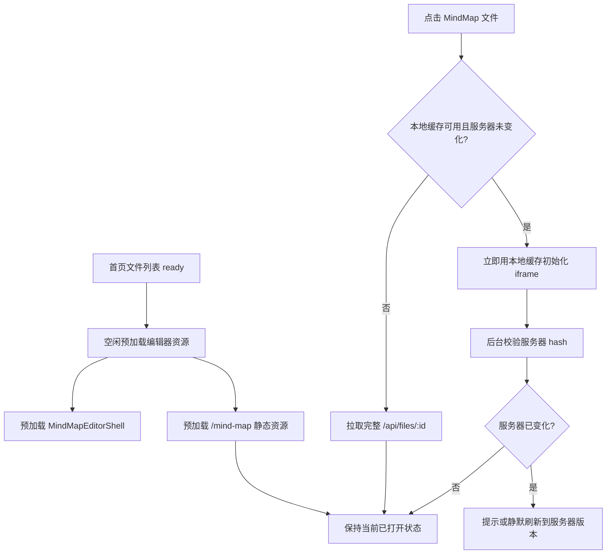

# MindMap 打开性能对齐 Excalidraw 优化方案

> 当前 MindMap 慢的主要原因不是 simple-mind-map 渲染慢，而是打开链路比 Excalidraw 多了“现拉宿主 chunk、现拉 iframe 大资源、每次先等完整文件 API”三段串行等待。

## 全景总览

> 优化目标是让 MindMap 像 Excalidraw 一样，把可提前做的加载提前，把可本地恢复的数据先恢复，把服务器校验放到后台或轻量接口中。

图解说明：首页文件列表加载完成后，不等待用户点击，后台提前加载 MindMap 宿主壳和 iframe 静态资源。用户点击文件后，先通过本地缓存和服务器 hash 判断能否立即打开；只有本地缓存缺失或服务器内容更新时，才拉完整文件数据。iframe 仍保留现有 Vue 原生编辑器，但它的资源加载不再全部压到点击之后。

## 一、现状证据

本轮调试日志显示，MindMap 打开慢主要分布在三段：

1. 从首页点击到 `MindMapEditorShell mounted` 约 5 秒，说明宿主 React 懒加载 chunk 在点击后才开始加载。
2. `ServerSync.getFile` 约 4.1 秒，说明当前 MindMap 打开被完整文件 API 串行阻塞。
3. iframe `ready` 和 Vue chunk 加载耗时明显，但 Vue 内部 `new MindMap` 约 5ms、`loadPlugins` 约 1ms，说明慢点不在思维导图实例初始化。

构建输出也印证资源压力：MindMap 主业务 chunk 约 3.22 MiB，vendor 约 1.07 MiB。这个体积如果在点击后才加载，会直接体现为“打开慢”。

## 二、为什么 Excalidraw 快

当前项目里的 Excalidraw 打开链路有三项 MindMap 尚未完全复用的设计。

### 2.1 首页 ready 后预加载编辑器

`excalidraw-app/App.tsx` 中 `useDeferredEditorPrefetch()` 会在文件列表完成加载后延迟 `import("./EditorShell")`。因此用户点击 Excalidraw 文件时，大部分编辑器代码已经在浏览器缓存中。

MindMap 当前也使用 `lazy(() => import("./MindMapEditorShell"))`，但没有被 `useDeferredEditorPrefetch()` 预加载，所以点击时才开始下载和解析。

### 2.2 本地缓存优先

`excalidraw-app/EditorShell.tsx` 的 `initializeScene()` 会先读取 `FileSyncState.getLocalCache()`，再通过 `ServerSync.listFileHashes()` 轻量判断服务器是否更新。若本地缓存存在且服务器未变，直接用本地数据初始化画布，不等待完整 `/api/files/:id`。

MindMap 当前 `MindMapEditorShell.tsx` 会先等待 `ServerSync.getFile(fileId)` 返回，再读取 `getCachedMindMapDocument(fileId)`。这导致即使本地已有可用缓存，也必须先等完整文件 API。

### 2.3 同应用组件，而不是二次 iframe 应用

Excalidraw 是 React/Vite 主应用内的组件，加载后直接通过 `initialData` 初始化。MindMap 当前是 iframe 内独立 Vue/Webpack 应用，需要额外加载 `/mind-map/index.html`、Vue runtime、Element UI、simple-mind-map、插件和 CSS。

短期不建议把 MindMap 改成 React 内嵌组件，因为迁移成本和风险高；更稳妥的做法是保留 iframe，但把 iframe 资源预加载和本地缓存优先补齐。

## 三、方案选型

### 方案 A：只做预加载

做法：在首页文件列表 ready 后，同时预加载 `MindMapEditorShell` 和 `/mind-map/index.html` 及关键 JS/CSS。

优点：改动小，风险低，能直接减少点击后的资源加载等待。

缺点：不能解决 `ServerSync.getFile` 4 秒级串行阻塞；重复打开仍然会等完整文件 API。

### 方案 B：预加载 + 本地缓存优先

做法：模仿 Excalidraw，把 MindMap 打开改成“本地缓存 + hash 校验优先”。本地缓存可用且服务器 hash 未变化时，立即初始化 iframe；完整文件拉取只在缓存缺失、服务器更新或缓存异常时发生。

优点：对齐 Excalidraw 的真实快路径，同时解决资源加载和文件读取两类等待。

缺点：需要谨慎处理本地缓存、服务器 hash、未保存草稿、后台刷新之间的状态一致性。

### 方案 C：重构 MindMap 打包和架构

做法：拆分 Vue/Webpack 大 chunk、按需加载插件，甚至逐步移除 iframe，把 MindMap 迁入主应用构建体系。

优点：长期收益最大，能从根上减少 iframe 和大包问题。

缺点：范围大，容易影响现有 MindMap 功能、AI、剪贴板、导出和历史版本，不适合作为第一轮性能修复。

推荐采用方案 B，先以最小风险模仿 Excalidraw 的快路径；方案 C 作为后续专项优化。

## 四、目标设计

### 4.1 预加载策略

扩展 `useDeferredEditorPrefetch()`：

1. 保留现有 `import("./EditorShell")`，不影响 Excalidraw。
2. 增加 `import("./MindMapEditorShell")`，让 MindMap 宿主壳提前进入浏览器模块缓存。
3. 增加低优先级 iframe 资源预热：
   - 先请求 `/mind-map/index.html`。
   - 解析或静态维护关键资源路径，预加载 app、vendor、主业务 chunk 和 CSS。
   - 若解析失败，只失败静默，不影响首页。

预加载触发时机保持和 Excalidraw 一致：文件列表数据 ready 后，延迟一小段时间执行，避免和首页缩略图首屏争抢。

### 4.2 MindMap 本地缓存优先

将 `MindMapEditorShell` 初始化拆成两阶段。

第一阶段：快速打开。

1. 读取 `getCachedMindMapDocument(fileId)`。
2. 读取 `FileSyncState.getServerHash(fileId)`、`FileSyncState.getDraftHash(fileId)`、`FileSyncState.getBaselineHash(fileId)`。
3. 若存在本地未保存草稿，优先用本地草稿初始化 iframe，并显示“已恢复本地草稿”。
4. 若存在本地缓存且没有明确服务器更新证据，先用本地缓存初始化 iframe。

第二阶段：后台校验。

1. 调用 `ServerSync.listFileHashes()` 获取轻量 hash。
2. 若服务器 hash 与本地记录一致，不拉完整文件。
3. 若服务器 hash 不一致，再调用 `ServerSync.getFile(fileId)` 拉完整文件。
4. 若当前没有本地未保存草稿，可以刷新为服务器版本。
5. 若当前存在未保存草稿，保持当前编辑状态，并提示用户服务器版本有变化，避免静默覆盖。

### 4.3 首次打开与缓存缺失

当本地没有 MindMap 缓存时，仍按现有逻辑调用 `ServerSync.getFile(fileId)`。拿到服务器数据后：

1. 解析为 `MindMapDocumentData`。
2. 写入 `FileSyncState.setLocalCache(fileId, ...)`。
3. 记录 `FileSyncState.setServerHash(fileId, serverRecord.content_sha256)`。
4. 对齐 baseline 和 draft hash。
5. 发送 `initMindMap` 给 iframe。

这样首次打开仍需要完整读取，但后续打开会进入 Excalidraw 式快路径。

### 4.4 iframe 生命周期

保留现有 iframe 通信协议：

1. iframe `ready` 后，宿主发送 `initMindMap`。
2. Vue 内部 `app_inited` 后，iframe 向宿主发 `appInited`。
3. 数据变化继续通过 `saveMindMapData`、`mindMapDirtyState`、`mindMapScaleState` 上报。

需要新增的只是资源预热，不改变 iframe 内部编辑行为。`requestId` 和 `revision` 仍作为保存一致性保护，不回退。

### 4.5 服务端耗时定位

保留当前前端 `[DEBUG] mindmap-open` 临时日志，新增服务端 `GET /api/files/:id` 耗时日志，用来区分 4 秒等待来自哪里：

1. DB 查文件行耗时。
2. 磁盘 `readFileSync` 耗时和文件字节数。
3. `JSON.parse` 耗时。
4. 返回响应总耗时。

如果服务端本身很快，则问题在浏览器请求排队、代理或并发资源加载；如果服务端读文件慢，再考虑文件体积、磁盘 IO 或同步读取改造。

## 五、建议实施顺序

### 第一步：补齐预加载

修改 `excalidraw-app/App.tsx`：

1. 在 `useDeferredEditorPrefetch()` 中增加 `import("./MindMapEditorShell")`。
2. 新增一个小的 `prefetchMindMapNativeAssets()` 函数，预热 `/mind-map/index.html` 和关键静态资源。
3. 预加载失败全部吞掉，不影响首页。

验收：刷新首页等待文件列表加载完成后，点击 MindMap 文件时，点击到 `MindMapEditorShell mounted` 的耗时应明显下降。

### 第二步：补齐 MindMap 缓存优先

修改 `excalidraw-app/MindMapEditorShell.tsx` 和 `excalidraw-app/hooks/useMindMapFileSave.ts`：

1. 抽出 `loadMindMapFromServer(fileId)`，负责完整文件读取、解析、缓存和 hash 对齐。
2. 抽出 `loadMindMapFromLocalCache(fileId)`，负责从本地缓存构造 init payload。
3. 初始化时先尝试本地缓存，成功后立即 `sendInitPayload()`。
4. 后台调用 `listFileHashes()` 判断服务器是否变化。
5. 只有必要时调用完整 `getFile()`。

验收：第二次打开同一 MindMap 时，即使 `/api/files/:id` 变慢，也应能先看到可编辑界面。

### 第三步：服务端和请求排队诊断

修改 `server/routes/files.js`：

1. 在 `router.get("/:id")` 加 `[DEBUG] files.getById |` 日志。
2. 记录 DB、磁盘读取、JSON parse、总耗时和文件大小。
3. 前端保留 `ServerSync.getFile` 前后耗时日志，便于和服务端对齐。

验收：再次打开 MindMap，能明确 4 秒耗时是否发生在服务端。

### 第四步：资源体积专项

在第一轮优化生效后再评估是否需要拆包。候选方向：

1. Vue 路由级拆分重组件。
2. 对导出类插件、AI 面板、公式、演示、XMind/PDF 导出做按需加载。
3. 检查 `mind-map/web/src/pages/Edit/components/Edit.vue` 顶部同步导入的插件是否可以延后注册。

验收：MindMap 主业务 chunk 下降，iframe `ready` 耗时进一步下降。

## 六、风险与处理

1. 本地缓存可能旧：使用服务器 `content_sha256` 判断；不确定时拉完整文件。
2. 未保存草稿不能被服务器版本覆盖：只要 `FileSyncState.hasUnsavedChanges(fileId)` 为 true，就优先保持本地草稿。
3. 预加载可能抢首屏资源：继续沿用 Excalidraw 的文件列表 ready 后延迟策略，不在首页首屏立即抢占。
4. iframe 资源路径可能带 hash：优先从 `/mind-map/index.html` 解析真实资源；解析失败时不阻塞打开。
5. 调试日志不能长期污染控制台：性能定位完成后，清理或改成受开关控制的 debug 日志。

## 七、验收标准

1. 首次打开 MindMap：日志能清楚显示宿主 chunk、文件 API、iframe ready、Vue 初始化各段耗时。
2. 第二次打开同一 MindMap：优先走本地缓存，用户应更快看到可编辑界面。
3. Excalidraw 打开路径不回退：`EditorShell` 预加载仍保留，打开 Excalidraw 文件行为不变。
4. 有未保存 MindMap 草稿时，打开后恢复本地草稿，不被服务器版本静默覆盖。
5. 服务器版本变化时，能检测到 hash 不一致，并按是否有本地草稿选择刷新或提示。
6. `yarn test:typecheck` 通过；MindMap web 构建通过并同步到 `public/mind-map`。
7. 性能定位完成后，临时 `[DEBUG] mindmap-open` 日志可按用户确认清理或改为开关控制。
