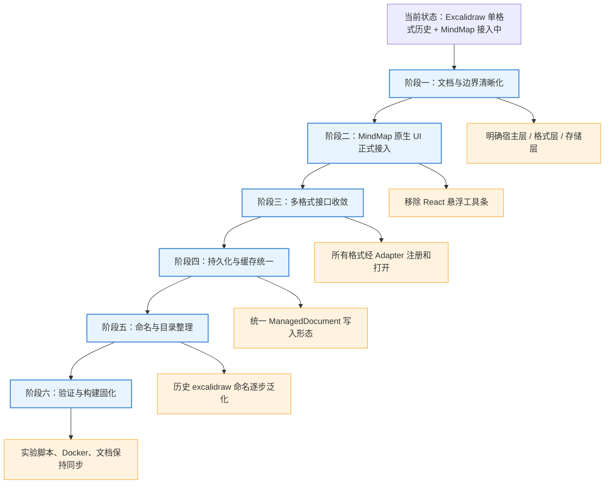

# 架构清晰化改造清单

> 目标不是大规模搬目录，而是先把系统边界稳定下来：宿主只关心文件和格式接口，Excalidraw 与 MindMap 作为并列格式各自实现编辑能力。

## 全景总览

> 架构清晰化应分阶段推进：先明确边界，再收敛接口，最后再考虑命名和目录整理。



图解说明：不要一开始就做大规模目录迁移。当前系统最需要的是稳定概念边界：`excalidraw-app` 是统一宿主，`packages/excalidraw` 与 `mind-map` 是并列格式实现，`DocumentFormatAdapter` 是多态接入层，`server` 是通用文件系统后端。等接口和持久化形态稳定后，再处理历史命名和目录重排。

## 一、阶段一：文档与边界清晰化

### 1.1 明确三层边界

需要把代码和文档都按三层理解：

- 宿主层：`excalidraw-app/`，负责文件列表、路由、AI 配置、API 同步、编辑器挂载。
- 格式层：`packages/excalidraw/` 与 `mind-map/`，分别负责具体编辑器和格式能力。
- 存储层：`server/` 与 `DATA_DIR`，负责通用文件元数据和 JSON 正文。

验收标准：后续文档、注释和新增代码不再把 `excalidraw-app` 描述成“只服务 Excalidraw 的应用”，而是统一文件管理宿主。

### 1.2 固化格式并列关系

需要在文档和实现中坚持以下关系：

```text
Excalidraw: kind=excalidraw + ExcalidrawAdapter + EditorShell + packages/excalidraw
MindMap:    kind=mindmap    + MindMapAdapter    + MindMapEditorShell + mind-map
```

验收标准：新增格式时不再复制某个格式的特殊路径，而是按 `kind + adapter + editor shell + thumbnail + version` 的组合接入。

### 1.3 标注历史命名

当前有一些命名已经泛化使用，但仍带 Excalidraw 色彩：

- `FileSyncState` 内部 key 前缀是 `excalidraw-file-`。
- 后端磁盘文件名是 `current.excalidraw`。
- `sceneHash.ts` 同时承担 scene hash 和 document hash。
- `forkFileTypes.ts` 只适合 Excalidraw 草稿缓存，但位置在通用 `data/` 下。

短期不需要立刻重命名，但文档中必须标注“历史命名，当前承担通用或半通用职责”。

## 二、阶段二：MindMap 原生 UI 正式接入

这一阶段承接 `MindMap原生UI适配功能修改清单.md`，目的是让 MindMap 作为完整格式编辑器，而不是 React 临时重做 UI。

需要修改：

1. 新增 `mind-map/web/src/utils/hostBridge.js`。
2. 修改 `mind-map/web/src/pages/Edit/components/Toolbar.vue`，把宿主按钮放进原生工具栏。
3. 必要时修改 `ToolbarNodeBtnList.vue`，处理工具栏自适应。
4. 修改 `mind-map/web/src/lang/*`，补齐文案。
5. 修改 `excalidraw-app/MindMapEditorShell.tsx`，只保留宿主桥接、保存、AI 弹窗和错误处理。
6. 精简 `excalidraw-app/MindMapEditorShell.scss`。
7. 构建并同步 `public/mind-map/`。

验收标准：

- MindMap 打开后看到的是原生 Vue 编辑器完整功能。
- 返回、保存、AI 设置出现在原生工具栏。
- React 层不再覆盖一组悬浮操作按钮。
- MindMap 与 Excalidraw 在文件列表中都通过 `kind` 打开各自编辑器。

## 三、阶段三：多格式接口收敛

### 3.1 统一格式注册入口

`excalidraw-app/data/formats/registry.ts` 应是所有格式注册的唯一入口。后续新增格式必须注册 adapter，并通过 `getDocumentFormatAdapter(kind)` 获取能力。

需要检查和收敛：

- `FileList` 的创建、导入、下载是否尽量走 adapter。
- `App.tsx` 的 `kind` 路由是否能清楚扩展新格式。
- 未支持格式是否统一进入 fallback。

### 3.2 收敛 Excalidraw 特殊导入路径

当前 Excalidraw 导入仍主要走 `loadExcalidrawFileAsServerSceneData()`，这是合理的历史兼容，但会让 `ExcalidrawAdapter` 看起来不是完整入口。

建议策略：

1. 短期保留特殊路径，文档标注原因。
2. 中期让 `ExcalidrawAdapter.parse()` 成为 `FileList` 导入 Excalidraw 的主要入口。
3. 长期把 PNG、SVG、`.excalidraw` 等复杂解析细节封装到 adapter 内部。

验收标准：维护者修改某个格式导入逻辑时，首先知道应该看该格式 adapter，而不是在 `FileList` 里到处找特殊分支。

### 3.3 统一格式能力描述

建议扩展或约定 adapter 能力描述：

- `kind`
- `displayName`
- `extensions`
- `mimeTypes`
- `createEmpty`
- `parse`
- `serialize`
- `toDocument`
- `buildThumbnail`
- `editorRoute` 或独立 editor registry

当前接口还没有 `displayName`、`buildThumbnail`、`editorRoute`。短期可以先不改接口，但文档中应把它们列为未来格式接入必须回答的问题。

## 四、阶段四：持久化与缓存统一

### 4.1 统一服务端 `data` 形态

长期目标是所有新写入文件都保存为：

```text
ManagedDocument<TData>
```

当前状态：

- Excalidraw：很多路径仍保存裸场景 `{ elements, appState, files }`。
- MindMap：保存为 `ManagedDocument<mindmap>`。

建议改造顺序：

1. 保持 `normalizeDocument()` 对裸 Excalidraw 场景的兼容。
2. 新建 Excalidraw 文件时逐步改为 `ExcalidrawAdapter.toDocument()`。
3. 保存 Excalidraw 时逐步保存 Managed 文档。
4. 下载旧文件时仍可输出用户期望的 `.excalidraw` 裸场景或兼容格式。

验收标准：服务端 `data` 对新文件统一为 Managed 外壳，旧文件仍能打开。

### 4.2 拆分 Excalidraw 草稿缓存和通用同步状态

当前 `FileSyncState` 同时承担：

- Excalidraw 本地缓存。
- 通用 baseline/draft/server hash。
- MindMap 复用 hash 状态。

建议拆成两个概念：

- `DocumentSyncState`：通用 hash、server sha、local edit time。
- `ExcalidrawLocalCache`：只处理 Excalidraw 的 elements、appState、files、deltas。
- `MindMapLocalCache`：只处理 MindMap 的 `mindmap-local-cache-${fileId}`。

短期可以保持现状，但新增代码不要继续把 Excalidraw 草稿缓存和通用同步状态绑得更深。

### 4.3 统一哈希命名

当前 `sceneHash.ts` 里有：

- `hashSceneSnapshot()`：Excalidraw 场景哈希。
- `hashDocumentSnapshot()`：Managed 文档或兼容对象哈希。

建议后续命名整理为：

- `hashExcalidrawScene()`
- `hashManagedDocument()`
- `hashFilePayload()`

短期不用急着改名，但新文档和新功能应优先使用“document hash / file payload hash”这类中性概念。

## 五、阶段五：命名与目录整理

### 5.1 不建议立即大搬目录

当前已有较多构建、Docker、Vite publicDir、workspace 和本地依赖关系。立即把目录移动到新的 `formats/` 或 `modules/` 可能引入大量构建风险。

建议先保持物理目录：

```text
excalidraw-app/
packages/excalidraw/
mind-map/
public/mind-map/
server/
```

通过文档和 adapter 边界让架构先清晰。

### 5.2 可以先做逻辑分组

可以在文档和代码注释中把格式线标出来：

```text
Excalidraw 格式线
  packages/excalidraw/
  excalidraw-app/EditorShell.tsx
  excalidraw-app/data/formats/ExcalidrawAdapter.ts

MindMap 格式线
  mind-map/
  public/mind-map/
  excalidraw-app/MindMapEditorShell.tsx
  excalidraw-app/data/formats/MindMapAdapter.ts
```

如果未来确实要重排目录，再考虑引入：

```text
formats/
  excalidraw/
  mindmap/
```

但这应该在接口收敛和测试稳定之后再做。

### 5.3 逐步替换历史命名

建议优先级：

1. 文档先使用 `document`、`format`、`host`、`adapter`。
2. 新增文件避免使用 `scene` 表示所有格式。
3. 通用模块逐步从 `excalidraw-file-*` 迁移到 `document-file-*`，保留读取旧 key 的兼容。
4. 后端文件名从 `current.excalidraw` 改为中性名称时必须提供迁移或兼容读取。

## 六、阶段六：验证与构建固化

### 6.1 更新验证脚本

需要确保已有实验脚本不再验证过时形态。例如 MindMap 不应再要求 React 工具条存在，而应验证原生 iframe、host bridge 和静态产物。

重点脚本：

- `experiments/p0-4-mindmap-react-vite-shell/validate.mjs`
- `experiments/p2-2-mindmap-adapter-mvp/validate.mjs`
- `experiments/p2-5-shared-ai-settings/validate.mjs`
- `experiments/p2-4-complete-todo-list/validate.mjs`

### 6.2 固化 MindMap 构建同步

当前 `mind-map/web` 是源码，`public/mind-map` 是运行时静态产物。需要固化一个明确命令或脚本：

```text
构建 mind-map/web
同步产物到 public/mind-map
运行主应用构建
```

验收标准：任何人修改 MindMap 原生 UI 后，都知道必须同步 `public/mind-map/`。

### 6.3 Docker 边界检查

需要持续检查：

- `Dockerfile.full` 是否复制 `mind-map/simple-mind-map/package.json`。
- `.dockerignore` 是否放行 `mind-map/`。
- `.dockerignore` 是否放行 `public/mind-map/dist/**`。
- `yarn build:app:docker` 是否能把 `public/mind-map` 带入最终静态站点。

## 七、推荐实施顺序

1. 先完成 MindMap 原生 UI 接入，消除“MindMap 是简化插件”的观感。
2. 补齐文档中的术语和边界，明确 Excalidraw 与 MindMap 是并列格式。
3. 把新格式接入流程固定为 `kind + adapter + editor shell + thumbnail + version`。
4. 收敛 `FileList` 中格式相关逻辑，尽量通过 adapter 处理导入和序列化。
5. 拆分通用同步状态和 Excalidraw 专属草稿缓存。
6. 逐步让 Excalidraw 新写入也使用 `ManagedDocument`。
7. 最后再考虑目录重排和历史命名迁移。

## 八、完成标准

架构清晰化完成后，应满足：

- 文件列表不知道每种格式内部数据结构，只根据 `kind` 和 adapter 工作。
- Excalidraw 与 MindMap 在文档、代码边界和 UI 入口上是并列关系。
- 每个格式都有明确源码、adapter、editor shell、thumbnail、version 记录。
- 后端只存通用文件元数据和 JSON 正文，不承载格式业务逻辑。
- 新增第三种格式时，不需要复制 Excalidraw 或 MindMap 的特殊分支。
- 构建与 Docker 能稳定包含 MindMap 运行时静态资源。
- 旧 Excalidraw 文件仍可打开，迁移过程不破坏历史数据。
